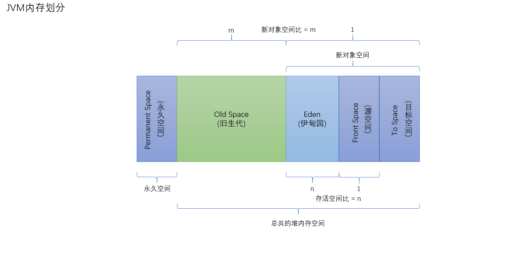
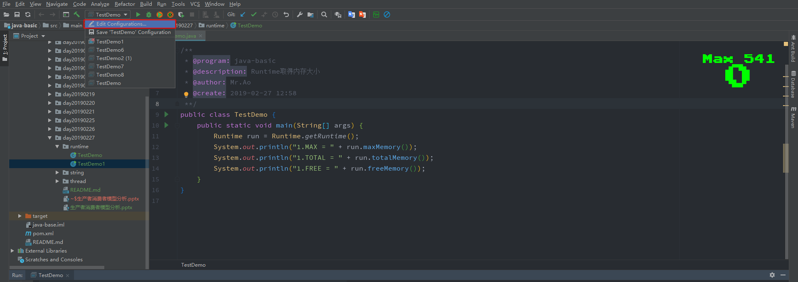
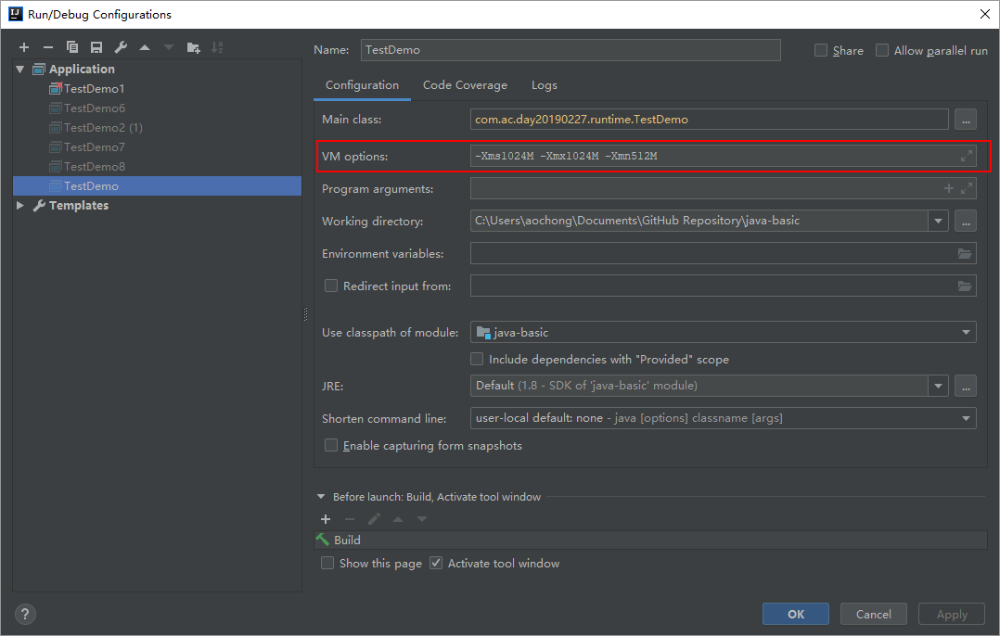
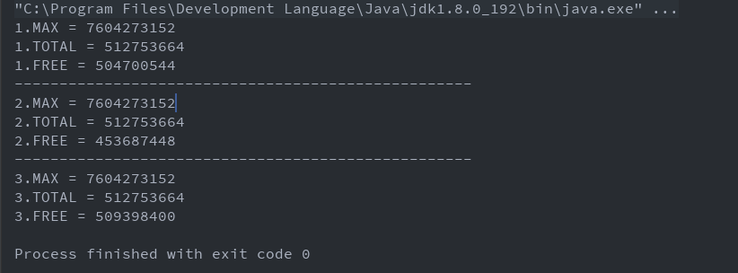
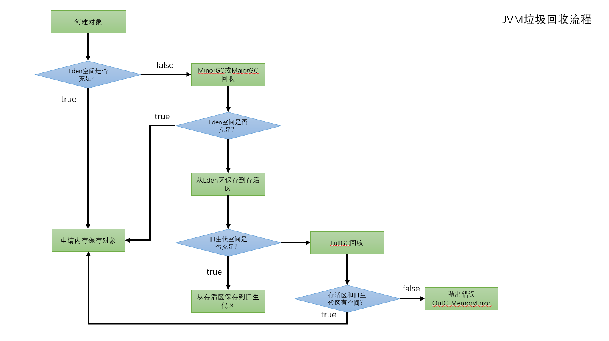

# 第三十六章：Java基础类库(Runtime类)

## 1. 知识点
> 1. Runtime类的设计特点；
> 2. Runtime类的使用；

## 2. 具体内容
在每一个Java进程之中都会存在有一个Runtime类的对象。由于此类的对象是由Java进程自己维护，所以在整个Runtime类设计的过程之中，只为用户提供了唯一的一个实例化对象，所以这个类所使用的就是单例设计模式，构造方法被私有化了。所以其类的内部一定会提供有一个static方法取得实例化对象。
* 取得Runtime类对象：`public static Runtime getRuntime()`

那么取得对象之后可以做什么呢？在Runtime类中定义有如下可以取得内存大小的方法：
* 最大内存大小：`public long maxMemory()`
* 总共内存大小：`public long totalMemory()`
* 空闲内存大小：`public long freeMemory()`

#### 范例：取得内存空间大小

```java
public class TestDemo {
    public static void main(String[] args) {
        Runtime run = Runtime.getRuntime();
        System.out.println("MAX = " + run.maxMemory());
        System.out.println("TOTAL = " + run.totalMemory());
        System.out.println("FREE = " + run.freeMemory());
    }
}
------------------------------------------
MAX = 7604273152(7252M)
TOTAL = 512753664(489M)
FREE = 504700544(483M)
```
##### 面试题：Java如何调整可用的内存大小？



Java中的内存划分主要有两个组成部分：
* 堆内存：保存的实例化对象的内容，在每一个JVM进程之中，对象的堆内存空间都会由垃圾收集器自动管理内存回收问题。
* 非堆内存(Eden+FrontSpace+To Space)：主要用于产生新的对象；
  * 所有方法的全局方法区；
  * 所有的static的全局数据区；
  * 永生代：负责存放反射对象的操作空间；

如果要想调整内存大小主要调整的就是堆内存空间，它的调整有如下三个参数：
* -Xms：初始的分配大小，为物理内存的1/64，最多不超过1G；
* -Xmx：最大分配内存，为物理内存的1/4；
* -Xmn：年轻代堆内存大小空间；

#### 范例：设置内存空间
`java -Xms1024M -Xmx1024M -Xmn512M TestDemo`



调整VM Option



代码运行结果如下：可见数值均变大了。


```java
public class TestDemo {
    public static void main(String[] args) {
        Runtime run = Runtime.getRuntime();
        System.out.println("1.MAX = " + run.maxMemory());
        System.out.println("1.TOTAL = " + run.totalMemory());
        System.out.println("1.FREE = " + run.freeMemory());
        String str = "";
        for(int x=0;x<2000;x++){
            str += x;
        }
        System.out.println("2.MAX = " + run.maxMemory());
        System.out.println("2.TOTAL = " + run.totalMemory());
        System.out.println("2.FREE = " + run.freeMemory());
    }
}
```


在Runtime类中提供有垃圾收集机制：`public void gc()`

#### 范例：垃圾回收
```java
public class TestDemo2 {
    public static void main(String[] args) {
        Runtime run = Runtime.getRuntime();
        System.out.println("1.MAX = " + run.maxMemory());
        System.out.println("1.TOTAL = " + run.totalMemory());
        System.out.println("1.FREE = " + run.freeMemory());
        System.out.println("---------------------------------------------------");
        String str = "";
        for(int x=0;x<2000;x++){
            str += x;
        }
        System.out.println("2.MAX = " + run.maxMemory());
        System.out.println("2.TOTAL = " + run.totalMemory());
        System.out.println("2.FREE = " + run.freeMemory());
        System.out.println("---------------------------------------------------");
        run.gc();
        System.out.println("3.MAX = " + run.maxMemory());
        System.out.println("3.TOTAL = " + run.totalMemory());
        System.out.println("3.FREE = " + run.freeMemory());
    }
}
```



那么回收到底经历过哪些问题呢？



简单点说：
* 新的对象保存在Eden区，之后此对象保存在年轻代区；而后在进行GC之后所以被保留下的年轻代中的对象(从GC、MinorGC)，将保存在旧生代(主GC、MajorGC)。
* 如果再有新的对象，从年轻代回收，再找到旧生代，最后都没空间，进行垃圾的全部扫描(Full GC)。

##### 面试题：请问什么是GC，该如何操作GC？
* GC指的是垃圾收集，对于GC的操作可以利用Runtime类中的gc()方法手工释放，或者是利用系统自动进行释放；

## 3. 知识点总结
> 1. Runtime使用了单例设计模式，每一个JVM进程只会存在有一个Runtime类对象；
> 2. Runtime类提供有gc()方法可以进行垃圾收集处理；
