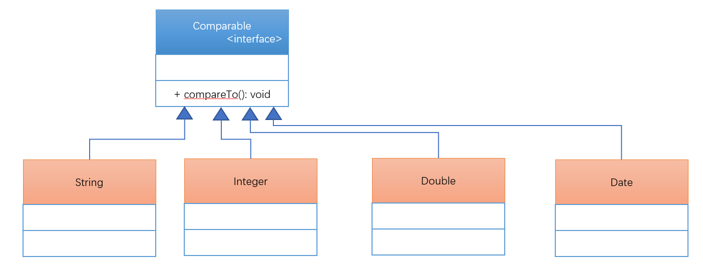
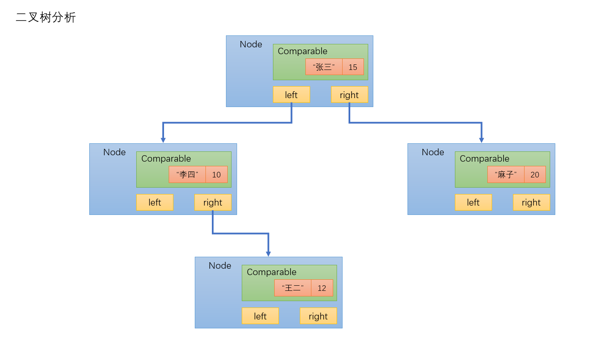

# 第三十九章：比较器(Arrays)

## 1. 知识点
> 1. 数组操作类：Arrays；
> 2. 两种比较器的使用：Comparaable、Comparator；
> 3. 实现二叉树算法；

## 2. 具体内容
### 2.1 数组操作类：Arrays
Arrays类一早就开始使用了，最早使用的是它的排序操作，但是现在打开Arrays类观察一下有哪些方法。
* 二分查找：`public static int binarySearch(数据类型[] a,数据类型 key)`
* 数组比较：`public static boolean equals(数据类型[] a,数据类型[] a2)`
* 数组填充：`public static void fill(数据类型[] a,数据类型 val)`
* 数组转换为String：`public static String toString(数据类型[] a)`

#### 范例:二分查找
```java
public class TestDemo {
    public static void main(String[] args) {
        int[] data = new int[]{1,565,78343,86,79,93,45,23};
        Arrays.sort(data);
        System.out.println(Arrays.binarySearch(data,565));
    }
}
```
#### 范例：数组比较
```java
public class TestDemo1 {
    public static void main(String[] args) {
        int[] data1 = new int[]{1,2,3};
        Arrays.sort(data1);
        int[] data2 = new int[]{2,1,3};
        Arrays.sort(data2);
        System.out.println(Arrays.equals(data1,data2));
    }
}
```
#### 范例：数据填充
```java
public class TestDemo2 {
    public static void main(String[] args) {
        int[] data = new int[]{1,2,3};
        Arrays.fill(data,10);
        System.out.println(Arrays.toString(data));
    }
}
```
在Arrays类中几乎包含了所有可能使用到的数组的相关操作。
### 2.2 Comparable接口(比较器)
在Arrays类中提供有一个方法：`public static void sort(数据类型[] a)`，此方法可以直接针对于对象数组进行排序的操作。

但是现在真的要进行对象数组的排序，并不是意味着直接调用此方法即可，如果直接调用会出现如下的错误信息：
```java
class Person{
    private String name;
    private int age;

    public Person(String name,int age){
        this.name = name;
        this.age = age;
    }

    public String getName() {
        return name;
    }

    public void setName(String name) {
        this.name = name;
    }

    public int getAge() {
        return age;
    }

    public void setAge(int age) {
        this.age = age;
    }

    @Override
    public String toString() {
        return "Person{" +
                "name='" + name + '\'' +
                ", age=" + age +
                '}';
    }
}
public class TestDemo3 {
    public static void main(String[] args) {
        Person[] per = new Person[]{
                new Person("张三",20),
                new Person("李四",35),
                new Person("王二",18)
        };
        Arrays.sort(per);
        System.out.println(Arrays.toString(per));
    }
}
---------------------------------------------------------
Exception in thread "main" java.lang.ClassCastException: com.ac.day20190228.array.Person cannot be cast to java.lang.Comparable
	at java.util.ComparableTimSort.countRunAndMakeAscending(ComparableTimSort.java:320)
	at java.util.ComparableTimSort.sort(ComparableTimSort.java:188)
	at java.util.Arrays.sort(Arrays.java:1246)
	at com.ac.day20190228.array.TestDemo3.main(TestDemo3.java:51)
```
之所以造成这样的问题，是因为如果要进行对象数组的排序，必须要解决数据的大小关系问题，然而对象无法区分出大小关系，那么为了解决这样的一个问题，Java会自动在排序的时候将所有的对象强制转换为Comparable接口对象。如果要想对象数组的自动排序，那么对象所在的类一定要实现Comparable接口。这个接口定义如下：
```java
public interface Comparable<T>{
	public int compareTo(T o);
}
```

String类中的compareTo()方法本身就是覆写了Comparable接口中的compareTo(),而如果说用户现在需要进行排序实际上只需要返回三个内容即可：0、-1、1。
#### 范例：对象数组排序
```java
class Person implements Comparable<Person>{
    private String name;
    private int age;

    public Person(String name,int age){
        this.name = name;
        this.age = age;
    }

    public String getName() {
        return name;
    }

    public void setName(String name) {
        this.name = name;
    }

    public int getAge() {
        return age;
    }

    public void setAge(int age) {
        this.age = age;
    }

    @Override
    public int compareTo(Person o) {
        if(this.age > o.age){
            return 1;
        }else if(this.age == o.age){
            return 0;
        }else {
            return -1;
        }
    }

    @Override
    public String toString() {
        return "Person{" +
                "name='" + name + '\'' +
                ", age=" + age +
                '}';
    }
}
public class TestDemo3 {
    public static void main(String[] args) {
        Person[] per = new Person[]{
                new Person("张三",20),
                new Person("李四",35),
                new Person("王二",18)
        };
        Arrays.sort(per);
        System.out.println(Arrays.toString(per));
    }
}
-------------------------------------------------
@Override
public int compareTo(Person o) {
    return this.age - o.age;
}
```
**结论：** 以后不管何种情况下，只要进行对象数组的排序，一定要使用Comparable接口完成。
### 2.3 二叉树算法实现(Binary Tree、BT)
二叉树也好，链表也好，本质其实是一样的，目的是为了保存多个数据，实现动态的对象数组。所有的数据结构都一定有一个前提：必须通过节点来进行数据的包裹，目的：确定先后顺序。那么现在也可以对Node进行修改，让其可以保存对象（Object、Comparable）、但是现在每一个节点上要保存有两个子节点：左子树、右子树。
* 保存数据的原则：比根节点小的数据放在左子树，比根节点大或者等于的数据保存在右子树。


最后按照中序遍历（左-根-右）的方式可以取得内容，所以数据是排序后的结果。
#### 范例：实现基础二叉树
```java
class Person implements Comparable<Person> {
    private String name;
    private int age;

    public Person(String name, int age) {
        this.name = name;
        this.age = age;
    }

    public String getName() {
        return name;
    }

    public void setName(String name) {
        this.name = name;
    }

    public int getAge() {
        return age;
    }

    public void setAge(int age) {
        this.age = age;
    }

    @Override
    public int compareTo(Person o) {
        return this.age - o.age;
    }

    @Override
    public String toString() {
        return "Person{" +
                "name='" + name + '\'' +
                ", age=" + age +
                '}';
    }
}

class BinaryTree {
    public class Node {
        private Comparable data;
        private Node left;
        private Node right;

        public Node(Comparable data) {
            this.data = data;
        }

        public void addNode(Node newNode) {
            if (this.data.compareTo(newNode.data) > 0) {
                if (this.left == null) {
                    this.left = newNode;
                } else {
                    this.left.addNode(newNode);
                }
            } else {
                if (this.right == null) {
                    this.right = newNode;
                } else {
                    this.right.addNode(newNode);

                }
            }
        }

        public void toArrayNode(){
            if(this.left != null){
                this.left.toArrayNode();
            }
            BinaryTree.this.retData[BinaryTree.this.foot ++] = this.data;
            if(this.right != null){
                this.right.toArrayNode();
            }
        }

    }

    private Node root;
    private int count = 0;
    private int foot = 0;
    private Object[] retData;

    public void add(Object obj) {
        Comparable data = (Comparable) obj;
        Node newNode = new Node(data);
        if (this.root == null) {
            this.root = newNode;
        } else {
            this.root.addNode(newNode);
        }
        this.count ++;
    }

    public Object[] toArray(){
        if(this.count > 0){
            this.foot = 0;
            this.retData = new Object[this.count];
            this.root.toArrayNode();
            return this.retData;
        }else{
            return null;
        }
    }

}
public class TestDemo3 {
    public static void main(String[] args) {
        BinaryTree bt = new BinaryTree();
        bt.add(new Person("张三",15));
        bt.add(new Person("李四",10));
        bt.add(new Person("王二",12));
        bt.add(new Person("麻子",20));
        System.out.println(Arrays.toString(bt.toArray()));
    }
}
-------------------------------------------------
[Person{name='李四', age=10}, Person{name='王二', age=12}, Person{name='张三', age=15}, Person{name='麻子', age=20}]
```

### 2.4 挽救的比较器：Comparator(建议不要使用)
通过Comparable的观察可以发现，如果一个类的对象要想进行对象数组排序，那么这个类在定义的时候就必须明确的实现好Comparable接口，但是有没有这样一种可能性出现，一个原本定义完成了，原本是没有排序要求的，可是后期却需要追加排序，并且这个类以及不能够在修改了。那么在这种情况下，就可以利用另外一个接口完成排序：java.util.Comparator接口，此接口定义如下：
```java
@FunctionalInterface
public interface Comparator<T>{
	public int compare(T o1,T o2);
	public boolean equals(Object obj);
}
```
如果要想继续使用Arrays实现排序操作，那么就继续观察新的排序方法：`public static <T> void sort(T[] a, Comparator<? super T> c)`

#### 范例：定义一个单独的Person类
```java
class Person2{
    private String name;
    private int age;

    public Person2(String name,int age){
        this.name = name;
        this.age = age;
    }

    public String getName() {
        return name;
    }

    public void setName(String name) {
        this.name = name;
    }

    public int getAge() {
        return age;
    }

    public void setAge(int age) {
        this.age = age;
    }

    @Override
    public String toString() {
        return "Person{" +
                "name='" + name + '\'' +
                ", age=" + age +
                '}';
    }
}
```
#### 范例：实现一个单独的比较器
```java
class PersonComparator implements Comparator<Person2> {
    @Override
    public int compare(Person2 o1, Person2 o2) {
        return o1.getAge() - o2.getAge();
    }
}
```
#### 范例：使用PersonComparator比较器
```java
public class TestDemo5 {
    public static void main(String[] args) {
        Person2[] per = new Person2[]{
                new Person2("张三",20),
                new Person2("李四",35),
                new Person2("王二",18)
        };
        Arrays.sort(per,new PersonComparator());
        System.out.println(Arrays.toString(per));
    }
}
-----------------------------------------------
[Person{name='王二', age=18}, Person{name='张三', age=20}, Person{name='李四', age=35}]
```
面试题：请解释两种比较器的区别？
* 在进行对象数组排序的过程之中需要使用到比较器，比较器有两个：Comparable、Comparator；
* java.lang.Comparable：是在类定义的时候默认实现好的接口，里面提供有一个compareTo()方法用于大小的比较；
* java.util.Comparator：需要单独定义一个排序的比较规则，里面有两个方法：compare()、equals()；

## 3. 知识点总结
以后如果在开发之中考虑到排序的需求，有限考虑使用Comparable接口。
