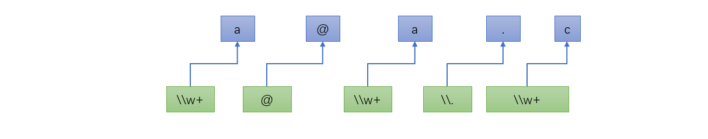
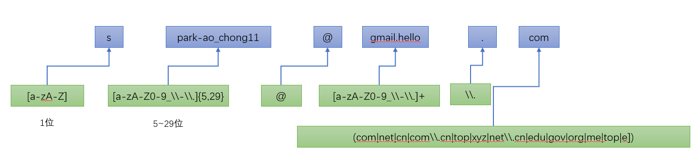

# 第四十章：正则表达式

## 1. 知识点
> 1.了解正则表达式的好处；
2. 正则表达式的基础语法；
3. 正则表达式的具体操作；

## 2. 具体内容
### 2.1 什么是正则表达式
为了能够更加清楚的认识到正则的意义所在，下面编写一个简单的程序：判断一个字符串是否由数字所组成
#### 范例：最原始实现
```java
public class TestDemo {
    public static void main(String[] args) {
        String str = "12387aa6465";
        System.out.println(isNumber(str));
    }
    public static boolean isNumber(String data){
        char[] result = data.toCharArray();
        for(int x=0;x<result.length;x++){
            if(result[x]<'0' || result[x]>'9'){
                return false;
            }
        }
        return true;
    }
}
```
以上程序的做法是可以完全简化的；
#### 范例：使用正则匹配
```java
public class TestDemo1 {
    public static void main(String[] args) {
        String str = "12387aa6465";
        System.out.println(str.matches("\\d+"));
    }
}
```
通过以上的代码可以发现，正则表达式给我们用户到来最直观的感受是减少了程序的代码，实质上就属于加强了String类的操作支持。

### 2.2 认识正则表达式(常用正则标记)
正则表达式是在JDK1.4的时候正式追加到Java之中的，其最早起源于Linux系统下。在最早的Java开发时代要想使用正则开发，那么必须去通过apache下载相应的正则表达式的开发包才可以完成。因为在JDK1.4中提供有一个新的程序包：java.uril.regex，就是之中的支持包，而且这个包中主要有两个类：Pattern、Matcher类，其中Pattern类中提供有常用的正则标记说明，下面来看几个常用的正则语法：
* 字符（如果不加入量词，那么就表示单个字符）
  * a：表示由指定的字母a所组成；
  * \\：匹配<mark>"\"</mark>，是一个转义字符；
  * \t：匹配<mark>"\t"</mark>的转义字符；
  * \n：匹配<mark>换行</mark>的转义字符；
* 字符范围（如果不加入量词，表示单个字符）
  * <mark>p[abc]</mark>：表示可能是字母a、b、c的任意一位；
  * <mark>[^abc]</mark>：表示不是字母a、b、c的任意一位；
  * <mark>[a-zA-Z]</mark>：表示由任意一位字母（大写或小写）组成；
  * <mark>[0-9]</mark>：表示由任意一位数字所组成；
* 简化表达式（如果不加入量词，表示单个字符）
  * <mark>.</mark>：表示任意一位字符；
  * <mark>\d</mark>：表示任意的一位数字，等价于<mark>[0-9]</mark>;
  * <mark>\D</mark>：表示任意的一位非数字，等价于<mark>[^0-9]</mark>;
  * <mark>\w</mark>：表示任意的一位字符，由字母、数字、_所组成，等价于<mark>[a-zA-Z0-9 _]</mark>；
  * <mark>\W</mark>:：表示任意的一位非指定字符（不是字母数字_）,等价于<mark>[^a-zA-Z0-9 _]</mark>；
  * <mark>\s</mark>：可能是<mark>\n</mark>,<mark>\t</mark>；
  * <mark>\S</mark>：表示任意的一位非空格；
* 边界匹配
  * <mark>^</mark>：表示正则匹配的开始；
  * <mark>$</mark>：表示正则匹配的结束；
* 量词描述（如果没有量词，那么每一个出现的正则都只能匹配一位字符）
  * <mark>表达式?</mark>：表示此正则表达式可以出现0次或者1次；
  * <mark>表达式+</mark>：表示此正则表达式可以出现1次或多次；
  * <mark>表达式*</mark>：表示此正则可以出现0次、1次、或多次；
  * <mark>表达式{n}</mark>：表示正好出现n次；
  * <mark>表达式{n,}</mark>：表示正则表达式正好出现n次以上，包含n次；
  * <mark>表达式{n,m}</mark>：表示此正则表达式出现n~m次；
* 逻辑运算
  * <mark>X正则Y正则</mark>：表示X正则之后紧跟着验证Y正则；
  * <mark>X正则|Y正则</mark>：表示X、Y正则选一个；
  * <mark>()</mark>：一组正则；

### 2.3 String类对正则的支持
如果要进行正则的操作本质上应该使用Pattern或Matcher两个类来完成，但是从实际的开发来讲，大部分的开发者不会去直接使用这两个类，因为在JDK1.4之后，String类对正则做出了支持，增加如下的若干方法：

| No  | 方法名称                                                    | 类型 | 描述         |
| --- | ----------------------------------------------------------- | ---- | ------------ |
| 1   | public boolean matches(String regex)                        | 普通 | 正则匹配验证 |
| 2   | public String replaceAll(String regex,String replacement)   | 普通 | 全部替换     |
| 3   | public String replaceFirst(String regex,String replacement) | 普通 | 替换首个字符 |
| 4   | public String[] split(String regex)                         | 普通 | 拆分         |
| 5   | public String[] split(String regex,int limit)               | 普通 | 部分拆分     |

#### 范例：替换操作
```java
public class TestDemo2 {
    public static void main(String[] args) {
        String str = "fghj4653265@#$$$___";
        String regex = "[^a-zA-Z]";
        System.out.println(str.replaceAll(regex,""));
    }
}
```
#### 范例：拆分操作
```java
public class TestDemo3 {
    public static void main(String[] args) {
        String str = "fs4564wsdf7434@fhkj.fsa";
        //[a-zA-Z]+
        String regex = "\\d+";
        System.out.println(Arrays.toString(str.split(regex)));
    }
}
```
对于替换和拆分操作使用正则并不麻烦，最麻烦的是进行字符串的结构验证。
#### 范例：判断某一个字符串是否是小数，如果是将其转换为Double类型
```java
public class TestDemo4 {
    public static void main(String[] args) {
        String str = "15.";
        String regex = "\\d+(\\.\\d+)?";
        if(str.matches(regex)){
            System.out.println(Double.parseDouble(str));
        }else{
            System.out.println("匹配出错!");

        }
    }
}
```
#### 范例：匹配日期
如果要想将字符串变为日期则一定要使用SimpleDateFormat类，但是这个类需要满足特定的结构要求。
```java
public class TestDemo5 {
    public static void main(String[] args) {
        String str = "2019-03-03";
        String regex = "\\d{4}-\\d{2}-\\d{2}";
        if(str.matches(regex)){
            try {
                System.out.println(new SimpleDateFormat("yyyy-MM-dd").parse(str));
            } catch (ParseException e) {
                e.printStackTrace();
            }
        }else{
            System.out.println("匹配出错！");
        }
    }
}
```
#### 范例：匹配电话号码，这个电话号码的组成可能有如下几种：
* 第一种形式：62350411
```java
public class TestDemo6 {
    public static void main(String[] args) {
        String str = "62350411";
        String regex = "\\d{7,8}";
        System.out.println(str.matches(regex));
    }
}
```
* 第二种形式：010-62350411(01062350411)
```java
public class TestDemo6 {
    public static void main(String[] args) {
        String str = "01062350411";
        String regex = "(\\d{3,4}-?)\\d{7,8}";
        System.out.println(str.matches(regex));
    }
}
```
* 第三种形式：(010)-62350411
```java
public class TestDemo6 {
    public static void main(String[] args) {
        String str = "(010-62350411";
        String regex = "(\\d{3,4}-?)|(\\(\\d{3,4}\\)-?)\\d{7,8}";
        System.out.println(str.matches(regex));
    }
}
```
正则验证email地址那是相当好用的。
范例：验证email地址
* 简单验证：email由字母、数字、_所组成；



```java
public class TestDemo7 {
    public static void main(String[] args) {
        String str = "a@b.c";
        String regex = "\\w+@\\w+\\.\\w+";
        System.out.println(str.matches(regex));
    }
}
```
* 完整验证：在email中的用户名可以由字母、数字、_、-、.组成,长度为6~30位，其中要求以字母开头，同时在域名的后缀只能够是：.com、.cn、.com.cn、.net、,net.cn、.gov、.edu、.org、.me、.top、.e。



```java
public class TestDemo7 {
    public static void main(String[] args) {
        String str = "spark-ao_chong11@gmail.hello.com";
        String regex = "[a-zA-Z][a-zA-Z0-9_\\-\\.]{5,29}@[a-zA-Z0-9_\\-\\.]+\\.(com|net|cn|com\\.cn|edu|top|org|xyz|net\\.cn|gov|me|e)";
        System.out.println(str.matches(regex));
    }
}
```

## 2.4 java.util.regex包支持
实际上String给出的一系列的操作，在Pattern和Matcher类中均有支持。
* Pattern：
  * 编译正则：`public static Pattern compile(String regex)`
  * 字符串拆分：`public String[] split(CharSequence input)`

```java
  public class TestDemo8 {
    public static void main(String[] args) {
        String str = "fgjsh4643@@f89^&^fdh45646";
        String regex = "[^a-zA-Z]+";
        Pattern pat = Pattern.compile(regex);
        System.out.println(Arrays.toString(pat.split(str)));
    }
  }
```
* Matcher类，主要是进行匹配，Matcher类必须依靠Pattern类取得实例化对象：`public Matcher matcher(CharSequence input)`
  * 字符串匹配：`public boolean matches()`
  * 字符串替换：`public String replaceAll(String replacement)`

#### 范例：匹配操作
```java
public class TestDemo9 {
    public static void main(String[] args) {
        String str = "150";
        String regex = "\\d+";
        Pattern pat = Pattern.compile(regex);
        Matcher mat = pat.matcher(str);
        System.out.println(mat.matches());
    }
}
```
这两个类的主要功能都在String中提供了支持，所以大部分情况下不会考虑使用这两个类。
## 3. 知识点总结
正则表达式提供了更为强大的字符串验证与操作的功能，对于正则操作常用标记必须熟练，在所有的编程语言当中正则均支持，虽然调用形式不同但是标准的正则支持是完全一样的。
