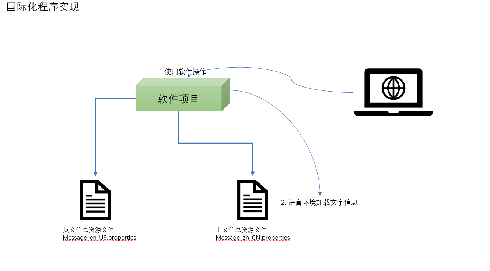

# 第四十二章：国际化程序实现

## 1. 知识点
> 1. Locale类的使用；
2. 国际化程序的实现，资源读取；

## 2. 具体内容
### 2.1 国际化程序实现原理
所谓的国际化的程序指的是一套代码，可以自动的根据操作系统的语言环境的不同，显示不同的语言。假如说现在某个系统可能在全世界所有的国家都可能使用到，那么现在假设系统操作业务流程不变的情况，那么要想让不同的国家使用这个系统最大的障碍就在于显示语言了。



### 2.2 Locale类
在java.util包中提供有一个Locale的类，这个类的主要功能是用于定位当前的城市以及语言环境。
如果要想确定语言环境必须知道城市编码以及语言的编码，中文：zh_CN、英文：en_US。

在Locale类中提供有一个城市及语言编码，可以进行Locale的定义：`public Locale(String language,String country)`

#### 范例：Locale类的使用
```java
public class TestDemo {
    public static void main(String[] args) {
        Locale  locale = new Locale("zh","CN");
        System.out.println(locale);
    }
}
-------------------------------------------
zh_CN
```
但是很多时候应该根据当前的操作系统语言环境选择才对，在Locale类中提供有一个取得当前环境的方法。
* 取得当前环境：`public static Locale getDefault()`
```java
public class TestDemo {
    public static void main(String[] args) {
        Locale  locale = Locale.getDefault();
        System.out.println(locale);
    }
}
```

使用Locale会牵扯到系统的变更问题。我不想去记编码，又不想使用系统默认。那么可以使用Locale类中定义的一堆常量：


即：Locale类就是用来确定语言环境的。

### 2.3 ResourceBundle类（确定资源文件）
在Java中使用*.properties定义的文件都是资源文件（后缀是固定的，不允许修改），而且资源文件的名称应该和类名称保持一样的命名风哥，例如：Message.properties，而在资源文件中保存的字符串的信息，这些信息必须按照<mark>key=value</mark>的形式保存。随后这个资源文件必须放在CLASSPATH下才可以被访问到，如果有包，则应该加上包名称后访问。
#### 范例：定义com.ac.day20190305.resource.Message.properties
`welcome.info=欢迎光临！`

在资源文件中不允许直接使用中文，中文信息必须自动转码。那么随后要想取得这个资源文件则可以依靠java.util.ResourceBundle类完成。`public abstract class ResourceBundle extends Object`，这个类是一个抽象类，而这个类中会提供有一个static方法取得本类对象：`public static final ResourceBundle getBundle(String baseName)`
* 这个方法上需要有一个资源文件的基本名字，Message。

而后就可以根据key取得对应的value信息：`public final String getString(String key)`

#### 范例：读取资源文件
```java
public class TestDemo1 {
    public static void main(String[] args) {
        Locale locale = Locale.getDefault();
        //设置资源文件的名称，但是没有后缀，资源文件保存在CLASSPATH之中
        ResourceBundle rb = ResourceBundle.getBundle("Message",locale);
        System.out.println(rb.getString("welcome.info"));
    }
}
```
此时资源就可以正常进行读取了。

### 2.4 实现国际化显示
国际化程序的关键就在于资源文件，在定义资源文件的时候需要针对于不同国家的城市与语言编码定义不同的资源文件，例如：中文的资源：Message_zh_CN.properties、英文的资源：Message_en_US.properties.
#### 范例：定义Message_zh_CN.properties
`welcome.info=您好，欢迎光临！`
#### 范例：定义Message_en_US.properties
`welcome.info=Hello,Welcome!`

要实现资源的定位需要依靠Locale类完成，而同时还需要与ResourceBundle类集合，使用如下方法取得ResourceBundle类的实例化对象：`public static final ResourceBundle getBundle(String baseName,Locale locale)`

#### 范例：读取中文资源文件
```java
public class TestDemo1 {
    public static void main(String[] args) {
        Locale locale = new Locale("zh","CN");
        //设置资源文件的名称，但是没有后缀，资源文件保存在CLASSPATH之中
        ResourceBundle rb = ResourceBundle.getBundle("Message",locale);
        System.out.println(rb.getString("welcome.info"));
    }
}
```
#### 范例：读取英文资源文件
```java
public class TestDemo1 {
    public static void main(String[] args) {
        Locale locale = new Locale("en","US");
        //设置资源文件的名称，但是没有后缀，资源文件保存在CLASSPATH之中
        ResourceBundle rb = ResourceBundle.getBundle("Message",locale);
        System.out.println(rb.getString("welcome.info"));
    }
}
```
但是这个时候会出现一个问题，假如在中文环境下说您好，得有个名：
* 现在"SMITH"进入系统，那么如果要欢迎的话应该带上名字显示，可以使用占位符。

#### 范例：修改Message_zh_CN.properties
`welcome.info={0},您好，欢迎光临！`
#### 范例：修改定义Message_en_US.properties
`welcome.info={0},Hello,Welcome!`

但是这个时候必须针对于读取出的数据进行一些转换，依靠java.text.MessageFormat类完成，此类定义有一个格式化文本的方法：`public static String format(String pattern,Object... arguments)`

#### 范例：格式化文本
```java
public class TestDemo1 {
    public static void main(String[] args) {
        Locale locale = new Locale("en","US");
        //设置资源文件的名称，但是没有后缀，资源文件保存在CLASSPATH之中
        ResourceBundle rb = ResourceBundle.getBundle("Message",locale);
        String str = rb.getString("welcome.info");
        System.out.println(MessageFormat.format(str,"SMITH"));
    }
}
```

在许多的项目开发遇之中，这样的格式化文本的操作是很常见的。

## 3. 知识点总结
国际化操作虽然给了我们可以进行多语言显示的能力，但是大部分情况下，使用国际化操作都是为了方便进行资源信息的读取操作。
