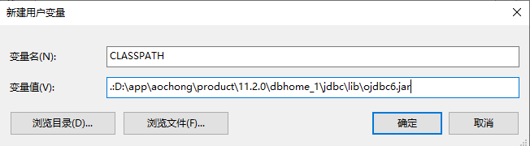
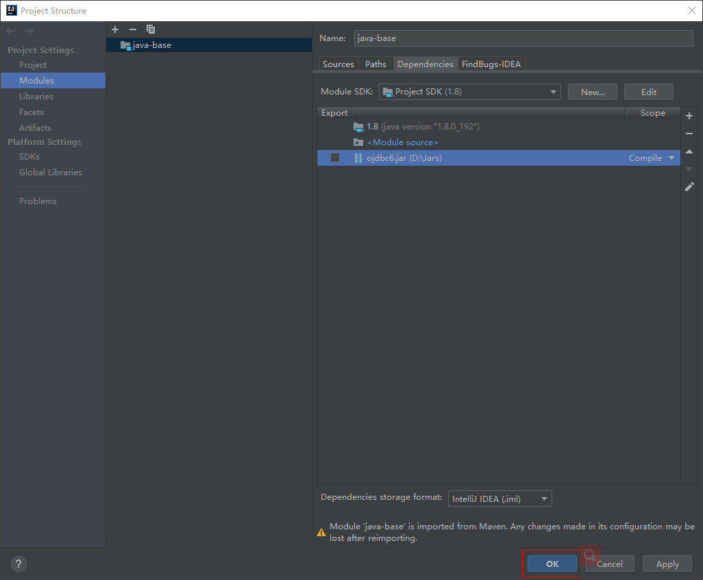
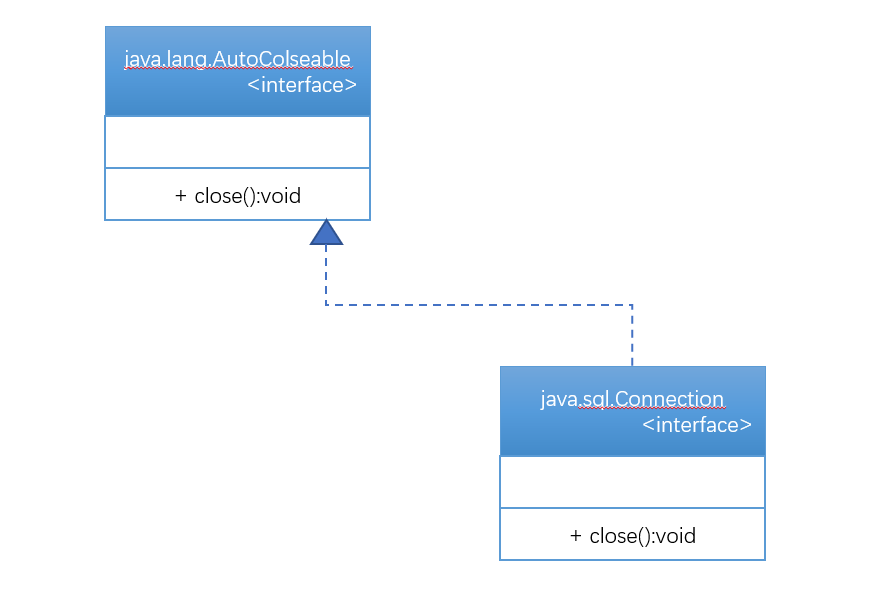
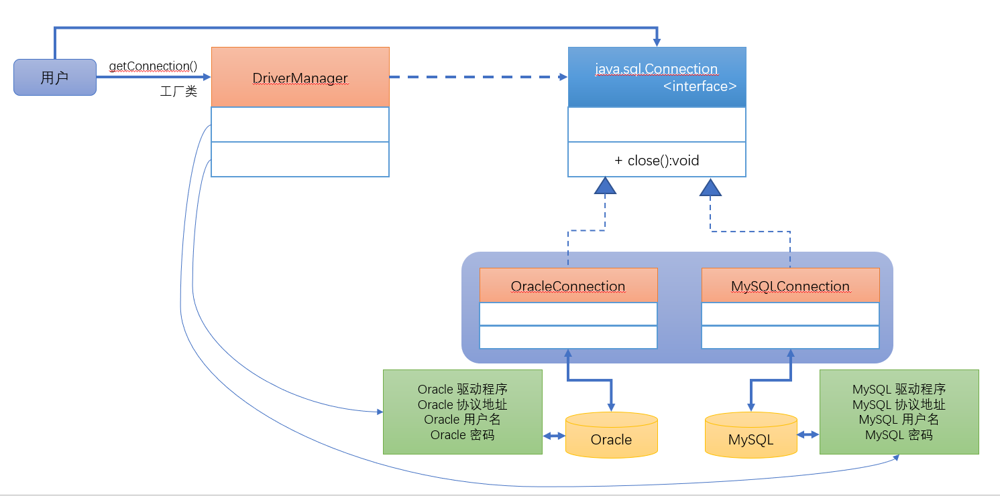
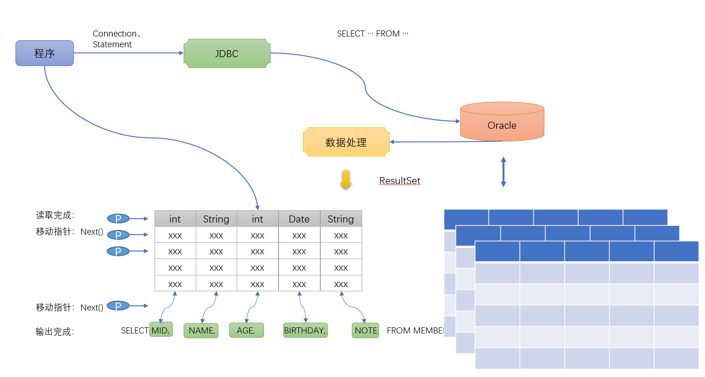

# 第四十四章：Java数据库编程（JDBC）

## 1 知识点
> 1. JDBC的基本功能；
2. Oracle数据的连接；
3. Statement的数据操作接口的使用；
4. PreparedStatement数据操作接口的使用；
5. 批处理与事务处理；

## 2 具体内容
### 2.1 JDBC简介
现在几乎所有的项目开发过程之中都不可能离开数据库，所以在Java提供的JDBC就非常有用处。JDBC严格来讲并不是一门技术，它属于一种服务，服务的特点在于：<mark>所有的操作流程都是固定的，</mark>JDBC是Java提供的数据库操作的标准。（它就是一组相关的标准接口），而不同的数据库的生产商要依据此标准进行自己的数据库操作类的具体实现提供。

而在实际的项目开发过程之中，JDBC的使用一共分为以下三种形式：
* JDBC-ODBC 桥接形式：利用微软提供的ODBC进行数据库的连接操作，而后利用JDBC访问ODBC的函数库实现数据的操作；
  * 流程：程序 -> JDBC -> ODBC -> 数据库 ，这样的操作性能很差，但是支持度是最高的，并且不需要配置任何第三方驱动程序；
* JDBC连接形式：利用不同数据库的生产商提供的JDBC驱动程序进行数据库的操作；
  * 流程：程序 -> JDBC -> 数据库，性能相较ODBC的形式是优的；
* JDBC网络连接：
  * 流程：程序 -> JDBC连接协议 -> 数据库 ，实际使用中用的最多；
*JDBC协议连接：使用特定数据库生产商提供的协议标准进行数据库的操作；

如果要进行JDBC操作，可以使用java.sql包进行开发，在这个包中就由以下几个类和接口组成：
* 类：DriverManager类；
* 接口：Connection、Stetement、PreparedStatement、ResultSet；

**总结：** JDBC一定是按照固定的代码编写形式使用的。
### 2.2 连接Oracle数据库
首先已经明确描述了JDBC的操作都是固定的流程，那么这个流程一共有如下四步：
* 第一步：加载数据库驱动程序；
* 第二步：依靠DriverManager类连接数据库；
* 第三步：进行数据库的CRUD操作（Statement、PreparedStatement、ResultSet）；
* 第四步：关闭数据库连接；

下面按照指定的步骤来实现数据库的连接操作。
1. 配置数据库驱动程序
本次将使用Oracle数据库提供的数据库连接的支持，但是如果要想进行Oracle的连接请一定要保证打开两个服务：监听（OracleOraDb11g_home1TNSListener）、实例（OracleServiceORCL）

随后需要配置数据库的驱动程序，驱动程序的路径：`D:\app\aochong\product\11.2.0\dbhome_1\jdbc\lib\ojdbc6.jar`

如果现在使用的是记事本开发，那么需要在CLASSPATH中配置此驱动程序路径。



然而现在使用的是IDEA开发工具配置，则需要在【Module】



2. 驱动加载
所以的数据库的驱动加载时向容器加载（每当使用java命令解释一个程序的时候都表示启动了一个JavaApplication的容器），利用ClassForName()加载，Oracle的驱动程序的类名称：`oracle.jdbc.driver.OracleDriver`
  * 如果没有配置驱动程序则会抛出找不到类的异常信息。

3. 数据库连接操作
如果要进行数据库的连接操作那么一定要使用java.sql.DriverManager程序类，那么这个类没有定义构造方法（私有化），所以如果要想操作这个类可以使用它的静态方法：
  * 连接数据库：`public static Connection getConnection(String url,String user,String password) throws SQLException`
这个方法会返回一个Connection接口对象，每一个Connection接口对象都表示一个数据库连接，而后在 getConnection()方法里面需要有三个参数：
    * `String url`：每一个数据库的连接地址都是不同的，使用的协议也是不同的，Oracle连接地址格式：
      *  标准格式：`jdbc:oracle:thin:@IP地址:端口号:数据库的SID名称`
      *  连接ORCL数据库：`jdbc:oracle:thin:@10.33.3.6:1521:orcl`
    * `String user`：连接用户名，使用scott
    * `String password`：连接密码，使用tiger
    ```java
    public static final String DBURL = "jdbc:oracle:thin:@10.33.3.6:1521:orcl";
    public static final String USERNAME = "scott";
    public static final String PASSWORD = "tiger";
    ```
    ```java
    Connection conn = DriverManager.getConnection(DBURL,USERNAME,PASSWORD);
    ```

4. 关闭数据库连接
如果要关闭数据库的连接操作，那么肯定是使用Connection所定义的方法，来观察此接口的定义：`public void close() throws SQLException`



**思考：** 为什么要提供有一个AutoCloseable接口呢？

只要是牵扯到资源操作，那么一定要解决的问题：必须关闭资源，关闭资源就属于释放资源，所以提供了AutoCloseable接口，但是这个接口不能够用正常的思路调用。
##### 范例：验证AutoCloseable接口
```java
class DataBase1 implements AutoCloseable{
    @Override
    public void close() throws Exception {
        System.out.println("该数据库的资源已经正常释放了！");
    }
    public void print(){
        System.out.println("Hello World!");
    }
}

public class AutoCloseableTest1{
    public static void main(String[] args){
       try(DataBase1 db = new DataBase1()){
            db.print();
       }catch(Exception e){
           e.printStackTrace();
       }
    }
}
```
AutoCloseable这种使用形式虽然看起来是自动完成了操作，但是用的几率不高。

##### 范例：数据库连接操作
```java
public class TestDemo {
    public static final String DBDRIVER = "oracle.jdbc.driver.OracleDriver";
    public static final String DBURL = "jdbc:oracle:thin:@10.33.3.6:1521:orcl";
    public static final String USERNAME = "scott";
    public static final String PASSWORD = "tiger";

    public static void main(String[] args) throws Exception{
        //第一步：加载数据库驱动程序
        Class.forName(DBDRIVER);
        //第二步：取得数据库连接对象
        Connection conn = DriverManager.getConnection(DBURL,USERNAME,PASSWORD);
        System.out.println(conn);
        //第三步：关闭数据库连接
        conn.close();
    }
}
```
疑问：为什么java.sql.Connection接口要通过DriverManager类打开？



整个数据库连接对象的取得使用的设计模式就是工厂设计模式。

### 2.3 Statement数据操作接口
利用Statement接口实现数据的CRUD操作。

在java.sql包中的Connection接口只是负责数据库的连接使用，它不具备数据的操作能力，而具有数据操作能力的接口只有Statement接口。如果要想取得Statement接口的对象可以通过Connection接口的如下方法完成：
* 实例化Statement对象：`Statement createStatement() throws SQLException`

但问题是，如果使用Statement大部分情况下操作的都是DML，所以在Statement接口中就提供有如下两个方法：
* 数据更新操作：`int executeUpdate(String sql) throws SQLException`
  * 在执行更新操作中返回的int数据表示该更新影响的数据行数；
* 数据查询操作：`ResultSet executeQuery(String sql) throws SQLException`
  *

##### 范例：数据库脚本
```sql
DROP TABLE member PURGE;
DROP SEQUENCE myseq;
CREATE SEQUENCE myseq;
CREATE TABLE member(
	mid	number,
	name VARCHAR2(50),
	age	NUMBER,
	birthday	DATE,
	note	CLOB,
	CONSTRAINT pk_mid PRIMARY KEY(mid)
);
```
在member表中mid字段的内容是依靠序列进行增长的。

#### 数据更新操作
数据更新操作分为：INSTER、UPDATE、DELETE三种形式。

###### 范例：增加数据
```java
public class TestDemo {
    public static final String DBDRIVER = "oracle.jdbc.driver.OracleDriver";
    public static final String DBURL = "jdbc:oracle:thin:@10.33.3.6:1521:orcl";
    public static final String USERNAME = "scott";
    public static final String PASSWORD = "tiger";

    public static void main(String[] args) throws Exception{
        //第一步：加载数据库驱动程序
        Class.forName(DBDRIVER);
        //第二步：取得数据库连接对象
        Connection conn = DriverManager.getConnection(DBURL,USERNAME,PASSWORD);
        //第三步：进行数据库的数据操作
        Statement stmt = conn.createStatement();
        String sql = "INSERT INTO member(mid,name,age,birthday,note) VALUES(myseq.nextval,'张三',10,TO_DATE('1989-10-10','yyyy-MM-dd'),'是一个人')";
        int len = stmt.executeUpdate(sql);
        System.out.println("影响的数据行数：" + len);
        //第四步：关闭数据库连接
        conn.close();
    }
}
```
###### 数据更新操作
```sql
UPDATE member SET NAME='李四',birthday=SYSDATE WHERE MID IN(2,3,4,5,6,7,8,9);
```

```java
public class TestDemo {
    public static final String DBDRIVER = "oracle.jdbc.driver.OracleDriver";
    public static final String DBURL = "jdbc:oracle:thin:@10.33.3.6:1521:orcl";
    public static final String USERNAME = "scott";
    public static final String PASSWORD = "tiger";

    public static void main(String[] args) throws Exception{
        //第一步：加载数据库驱动程序
        Class.forName(DBDRIVER);
        //第二步：取得数据库连接对象
        Connection conn = DriverManager.getConnection(DBURL,USERNAME,PASSWORD);
        //第三步：进行数据库的数据操作
        Statement stmt = conn.createStatement();
        String sql = "UPDATE member SET NAME='李四',birthday=SYSDATE WHERE MID IN(10,15,18)";
        int len = stmt.executeUpdate(sql);
        System.out.println("影响的数据行数：" + len);
        //第四步：关闭数据库连接
        conn.close();
    }
}
```

需要记住的是，在JDBC操作过程之中往往会出现两种异常：
* java.sql.SQLException：表示的是数据库连接出错；
* java.sql.SQLSyntaxErrorException：表示的是执行SQL语句错误；

###### 范例：数据的删除操作
```sql
DELETE FROM MEMBER WHERE MID BETWEEN 11 AND 20;
```

```java
public class TestDemo {
    public static final String DBDRIVER = "oracle.jdbc.driver.OracleDriver";
    public static final String DBURL = "jdbc:oracle:thin:@10.33.3.6:1521:orcl";
    public static final String USERNAME = "scott";
    public static final String PASSWORD = "tiger";

    public static void main(String[] args) throws Exception{
        //第一步：加载数据库驱动程序
        Class.forName(DBDRIVER);
        //第二步：取得数据库连接对象
        Connection conn = DriverManager.getConnection(DBURL,USERNAME,PASSWORD);
        //第三步：进行数据库的数据操作
        Statement stmt = conn.createStatement();
        String sql = "DELETE FROM MEMBER WHERE MID BETWEEN 11 AND 20";
        int len = stmt.executeUpdate(sql);
        System.out.println("影响的数据行数：" + len);
        //第四步：关闭数据库连接
        conn.close();
    }
}
```
对于整个数据的更新操作，方法都是完全一样的，使用的都是Statement接口中的executeUpdate()方法。

#### 数据查询操作
在进行数据查询操作的过程之中，最为麻烦的问题是需要将所有的查询结果进行保存，而程序操作的只是这些查询结果，为了保存这样的查询结果在java.sql包中引入了ResultSet接口的概念。在ResultSet处理结果的时候实际上是根据数据类型来进行处理的：



##### 范例：查询全部
```java
public class TestDemo2 {
    public static final String DBDRIVER = "oracle.jdbc.driver.OracleDriver";
    public static final String DBURL = "jdbc:oracle:thin:@10.33.3.6:1521:orcl";
    public static final String USERNAME = "scott";
    public static final String PASSWORD = "tiger";

    public static void main(String[] args) throws Exception{
        //第一步：加载数据库驱动程序
        Class.forName(DBDRIVER);
        //第二步：取得数据库连接对象
        Connection conn = DriverManager.getConnection(DBURL,USERNAME,PASSWORD);
        //第三步：进行数据库的数据操作
        Statement stmt = conn.createStatement();
        //以后开发代码中不允许写“*”
        String query = "SELECT mid,name,age,birthday,note FROM member";
        //数据库查询操作
        ResultSet rs = stmt.executeQuery(query);
        //知道循环结束条件，但是不知道循环次数，选择while循环
        while(rs.next()){//移动指针同时判断是否还有数据
            int mid = rs.getInt("mid");
            String name = rs.getString("name");
            int age = rs.getInt("age");
            Date birthday = rs.getDate("birthday");
            String note = rs.getString("note");
            System.out.println("mid = " + mid + ",name = " + name + ",age = " + age + ",birthday = " + birthday + ",note = " + note);
        }
        //第四步：关闭数据库连接
        conn.close();
    }
}
```
以上的代码已经都明确的写出了要查询的列名称，所以在使用getXxx()方法读取数据的时候就可以不写列名称了，直接编写序号就行了。
```java
public class TestDemo2 {
    public static final String DBDRIVER = "oracle.jdbc.driver.OracleDriver";
    public static final String DBURL = "jdbc:oracle:thin:@10.33.3.6:1521:orcl";
    public static final String USERNAME = "scott";
    public static final String PASSWORD = "tiger";

    public static void main(String[] args) throws Exception{
        //第一步：加载数据库驱动程序
        Class.forName(DBDRIVER);
        //第二步：取得数据库连接对象
        Connection conn = DriverManager.getConnection(DBURL,USERNAME,PASSWORD);
        //第三步：进行数据库的数据操作
        Statement stmt = conn.createStatement();
        //以后开发代码中不允许写“*”
        String query = "SELECT mid,name,age,birthday,note FROM member";
        //数据库查询操作
        ResultSet rs = stmt.executeQuery(query);
        //知道循环结束条件，但是不知道循环次数，选择while循环
        while(rs.next()){//移动指针同时判断是否还有数据
            int mid = rs.getInt(1);
            String name = rs.getString(2);
            int age = rs.getInt(3);
            Date birthday = rs.getDate(4);
            String note = rs.getString(5);
            System.out.println("mid = " + mid + ",name = " + name + ",age = " + age + ",birthday = " + birthday + ",note = " + note);
        }
        //第四步：关闭数据库连接
        conn.close();
    }
}
```
但是对于ResultSet取值需要有点说明：
* 所有的内容最好只取得一次；
* 所以的内容最好按照顺序取；

Statement使用了一种复合数据库开发人员的思路实现，都直接编写SQL语句执行。但是开发中没人使用Statement。

### 2.4 PreparedStatement数据操作接口
#### 2.4.1 Statement存在问题
Statement有一个最为严重的问题，在于所以的操作都需要使用完整的SQL语句执行，那么这个时候如果是由用户自己输入的，就会产生问题。

##### 范例：Statment接口问题
```java
public class TestDemo3 {
    public static final String DBDRIVER = "oracle.jdbc.driver.OracleDriver";
    public static final String DBURL = "jdbc:oracle:thin:@10.33.3.6:1521:orcl";
    public static final String USERNAME = "scott";
    public static final String PASSWORD = "tiger";

    public static void main(String[] args) throws Exception{
        String name = "Mr'SMITH";
        int age = 20;
        String birthday = "2019-03-11";
        String note = "是一个帅哥";
        //第一步：加载数据库驱动程序
        Class.forName(DBDRIVER);
        //第二步：取得数据库连接对象
        Connection conn = DriverManager.getConnection(DBURL,USERNAME,PASSWORD);
        //第三步：进行数据库的数据操作
        Statement stmt = conn.createStatement();
        String sql = "INSERT INTO member(mid,name,age,birthday,note) " +
                "VALUES(myseq.nextval,'" + name + "','"+ age + "',TO_DATE('" + birthday + "','yyyy-MM-dd'),'" +note+"')" ;
        System.out.println(sql);
        System.out.println(stmt.executeUpdate(sql));
        //第四步：关闭数据库连接
        conn.close();
    }
}
----------------------------------------
INSERT INTO member(mid,name,age,birthday,note) VALUES(myseq.nextval,'Mr'SMITH','20',TO_DATE('2019-03-11','yyyy-MM-dd'),'是一个帅哥')
Exception in thread "main" java.sql.SQLSyntaxErrorException: ORA-00917: 缺失逗号
```

在SQL语句之中，单引号是作为字符的标记，所以如果内容本身包含有字符，那么这种拼凑的处理过程就不能够使用了（需要做转义）。

#### 2.4.2 PreparedStatement操作

>Statement接口开发中不要使用，永远都优先考虑PreparedSatatement接口，这是Statement的子接口，使用预处理的方式来进行操作。如果要想取得PreparedStatement接口的实例化对象，那么继续依靠Connection接口完成，在Connection接口之中提供有这样一个操作方法：`PreparedStatement prepareStatement(String sql) throws SQLException`

所谓的预处理指的是在执行SQL语句的时候，是在创建PreparedStatement接口时，而具体的内容
使用**“?”**来进行占位，而后利用一系列的setXxx()方法设置内容。

由于创建PreparedStatement接口的时候就已经准备好了SQL语句，所以在执行SQL的时候就不再需要传递SQL语句了，使用PreparedStatement接口的如下方法实现数据库操作：
* 更新操作：`public int executeUpdate() throws SQLException`
* 查询操作：`public ResultSet executeQuery() throws SQLException`

>关于数据库中的日期时间描述，在程序中日期时间的描述使用的就是java.util.Date，但是在这个类下分别有三个子类：java.sql.Date、java.sql.Time、java.sql.Timestamp。

如果要想将java.util.Date变为具体的子类对象，那么必须依靠long数据类型：
* java.util.Date类存在有：`public long getTime()`
* java.sql.Date类的构造：`public Date(long date)`

##### 范例：利用PreparedStatment接口改进以上问题
```java
public class TestDemo4 {
    public static final String DBDRIVER = "oracle.jdbc.driver.OracleDriver";
    public static final String DBURL = "jdbc:oracle:thin:@10.33.3.6:1521:orcl";
    public static final String USERNAME = "scott";
    public static final String PASSWORD = "tiger";

    public static void main(String[] args) throws Exception{
        String name = "Mr'SMITH";
        int age = 20;
        Date birthday = new Date();
        String note = "是一个帅哥";
        //第一步：加载数据库驱动程序
        Class.forName(DBDRIVER);
        //第二步：取得数据库连接对象
        Connection conn = DriverManager.getConnection(DBURL,USERNAME,PASSWORD);
        //第三步：进行数据库的数据操作
        String sql = "INSERT INTO member(mid,name,age,birthday,note) " +
                "VALUES(myseq.nextval,?,?,?,?)" ;
        PreparedStatement pstmt = conn.prepareStatement(sql);
        pstmt.setString(1,name);
        pstmt.setInt(2,age);
        pstmt.setDate(3,new java.sql.Date(birthday.getTime()));
        pstmt.setString(4,note);
        System.out.println(pstmt.executeUpdate());
        //第四步：关闭数据库连接
        conn.close();
    }
}
```
此时更新与删除的操作是完全一样的。
在整个PreparedStatement接口里面最为重要的操作就在于查询的使用上，下面通过几个具体的查询案例来进行说明。

##### 范例：查询全部
```java
public class TestDemo5 {
    public static final String DBDRIVER = "oracle.jdbc.driver.OracleDriver";
    public static final String DBURL = "jdbc:oracle:thin:@10.33.3.6:1521:orcl";
    public static final String USERNAME = "scott";
    public static final String PASSWORD = "tiger";

    public static void main(String[] args) throws Exception{
        //第一步：加载数据库驱动程序
        Class.forName(DBDRIVER);
        //第二步：取得数据库连接对象
        Connection conn = DriverManager.getConnection(DBURL,USERNAME,PASSWORD);
        //第三步：进行数据库的数据操作
        String sql = "SELECT MID,NAME,AGE,BIRTHDAY,NOTE FROM MEMBER" ;
        PreparedStatement pstmt = conn.prepareStatement(sql);
        ResultSet rs = pstmt.executeQuery();
        while(rs.next()){
            int mid = rs.getInt(1);
            String name = rs.getString(2);
            int age = rs.getInt(3);
            Date birthday = rs.getDate(4);
            String note = rs.getString(5);
            System.out.println("mid = " + mid + ",name = " + name + ",age = " + age + ",birthday = " + birthday + ",note = " + note);
        }
        //第四步：关闭数据库连接
        conn.close();
    }
}
```

##### 范例：实现限定查询，根据MID查询
```java
public class TestDemo6 {
    public static final String DBDRIVER = "oracle.jdbc.driver.OracleDriver";
    public static final String DBURL = "jdbc:oracle:thin:@10.33.3.6:1521:orcl";
    public static final String USERNAME = "scott";
    public static final String PASSWORD = "tiger";

    public static void main(String[] args) throws Exception{
        //第一步：加载数据库驱动程序
        Class.forName(DBDRIVER);
        //第二步：取得数据库连接对象
        Connection conn = DriverManager.getConnection(DBURL,USERNAME,PASSWORD);
        //第三步：进行数据库的数据操作
        String sql = "SELECT MID,NAME,AGE,BIRTHDAY,NOTE FROM MEMBER WHERE MID=?" ;
        PreparedStatement pstmt = conn.prepareStatement(sql);
        pstmt.setInt(1,21);
        ResultSet rs = pstmt.executeQuery();
        if(rs.next()){
            int mid = rs.getInt(1);
            String name = rs.getString(2);
            int age = rs.getInt(3);
            Date birthday = rs.getDate(4);
            String note = rs.getString(5);
            System.out.println("mid = " + mid + ",name = " + name + ",age = " + age + ",birthday = " + birthday + ",note = " + note);
        }else{
            System.out.println("您查询的结果不存在！");
        }        //第四步：关闭数据库连接
        conn.close();
    }
}
```

##### 范例：模糊查询
模糊查询需要设置一个模糊查询的字段才可以。
```java
public class TestDemo7 {
    public static final String DBDRIVER = "oracle.jdbc.driver.OracleDriver";
    public static final String DBURL = "jdbc:oracle:thin:@10.33.3.6:1521:orcl";
    public static final String USERNAME = "scott";
    public static final String PASSWORD = "tiger";

    public static void main(String[] args) throws Exception{
        String keyWord = "张";
        //第一步：加载数据库驱动程序
        Class.forName(DBDRIVER);
        //第二步：取得数据库连接对象
        Connection conn = DriverManager.getConnection(DBURL,USERNAME,PASSWORD);
        //第三步：进行数据库的数据操作
        String sql = "SELECT mid,name,age,birthday,note FROM member WHERE name LIKE ?" ;
        PreparedStatement pstmt = conn.prepareStatement(sql);
        pstmt.setString(1,"%"+keyWord+"%");
        ResultSet rs = pstmt.executeQuery();
        while(rs.next()){
            int mid = rs.getInt(1);
            String name = rs.getString(2);
            int age = rs.getInt(3);
            Date birthday = rs.getDate(4);
            String note = rs.getString(5);
            System.out.println("mid = " + mid + ",name = " + name + ",age = " + age + ",birthday = " + birthday + ",note = " + note);
        }
        //第四步：关闭数据库连接
        conn.close();
    }
}
```
需要注意一点，使用占位符只能够设置数据，不能够设置表字段名称。

##### 范例：分页查询
```java
public class TestDemo8 {
    public static final String DBDRIVER = "oracle.jdbc.driver.OracleDriver";
    public static final String DBURL = "jdbc:oracle:thin:@10.33.3.6:1521:orcl";
    public static final String USERNAME = "scott";
    public static final String PASSWORD = "tiger";

    public static void main(String[] args) throws Exception{
        String keyWord = "张";
        int currentPage = 2;
        int pageSize = 5;
        //第一步：加载数据库驱动程序
        Class.forName(DBDRIVER);
        //第二步：取得数据库连接对象
        Connection conn = DriverManager.getConnection(DBURL,USERNAME,PASSWORD);
        //第三步：进行数据库的数据操作
        String sql = "SELECT * FROM (" +
                " SELECT mid,name,age,birthday,note,ROWNUM rn " +
                " FROM member " +
                " WHERE name LIKE ? AND ROWNUM<=? )temp " +
                " WHERE temp.rn>? ";
        PreparedStatement pstmt = conn.prepareStatement(sql);
        pstmt.setString(1,"%"+keyWord+"%");
        pstmt.setInt(2,currentPage * pageSize);
        pstmt.setInt(3,(currentPage-1) * pageSize);
        ResultSet rs = pstmt.executeQuery();
        while(rs.next()){
            int mid = rs.getInt(1);
            String name = rs.getString(2);
            int age = rs.getInt(3);
            Date birthday = rs.getDate(4);
            String note = rs.getString(5);
            System.out.println("mid = " + mid + ",name = " + name + ",age = " + age + ",birthday = " + birthday + ",note = " + note);
        }
        //第四步：关闭数据库连接
        conn.close();
    }
}
```
除了分页查询之外还存在统计查询。

##### 范例：查询数据表中的数据记录个数，使用COUNT()函数
使用COUNT()统计一定会返回结果，不管是否有数据
```java
public class TestDemo9 {
    public static final String DBDRIVER = "oracle.jdbc.driver.OracleDriver";
    public static final String DBURL = "jdbc:oracle:thin:@10.33.3.6:1521:orcl";
    public static final String USERNAME = "scott";
    public static final String PASSWORD = "tiger";

    public static void main(String[] args) throws Exception{
        //第一步：加载数据库驱动程序
        Class.forName(DBDRIVER);
        //第二步：取得数据库连接对象
        Connection conn = DriverManager.getConnection(DBURL,USERNAME,PASSWORD);
        //第三步：进行数据库的数据操作
        String sql = "SELECT COUNT(*) FROM MEMBER";
        PreparedStatement pstmt = conn.prepareStatement(sql);
        ResultSet rs = pstmt.executeQuery();
        if(rs.next()){
            int count = rs.getInt(1);
            System.out.println("count = " + count);
        }
        //第四步：关闭数据库连接
        conn.close();
    }
}
```
日后程序开发，以上的这些代码都是它的雏形。

### 2.5 批处理与事务处理
> 在之前的内容都属于JDBC1.0的时候定义的技术要求，在版本不断发展过程之中，JDBC技术也在不断完善，同时也增加了许多新的支持，从JDBC2.0开始出现了：ResultSet更新数据（增加、修改、删除）、可滚动结果集（ResultSet）、批处理操作。

所谓的批处理指的是将若干条语句一起进行执行，在Statement接口与PreparedStatement接口中都定义有批处理的支持方法：
* Statement接口：
  * 追加批处理：`public void addBatch(String sql) throws SQLException`
  * 执行批处理：`public int[] executeBatch() throws SQLException`
* PreparedStatement接口：
  * 追加批处理：`public void addBatch(String sql) throws SQLException`

##### 范例：利用Statement实现数据追加批处理
```Java
public class TestDemo10 {
    public static final String DBDRIVER = "oracle.jdbc.driver.OracleDriver";
    public static final String DBURL = "jdbc:oracle:thin:@10.33.3.6:1521:orcl";
    public static final String USERNAME = "scott";
    public static final String PASSWORD = "tiger";

    public static void main(String[] args) throws Exception{
        //第一步：加载数据库驱动程序
        Class.forName(DBDRIVER);
        //第二步：取得数据库连接对象
        Connection conn = DriverManager.getConnection(DBURL,USERNAME,PASSWORD);
        //第三步：进行数据库的数据操作
        Statement stmt = conn.createStatement();
        stmt.addBatch("INSERT INTO MEMBER(MID,NAME,AGE,BIRTHDAY,NOTE) VALUES(myseq.nextval,'李四',20,SYSDATE,'是一个帅哥')");
        stmt.addBatch("INSERT INTO MEMBER(MID,NAME,AGE,BIRTHDAY,NOTE) VALUES(myseq.nextval,'李四',20,SYSDATE,'是一个帅哥')");
        stmt.addBatch("INSERT INTO MEMBER(MID,NAME,AGE,BIRTHDAY,NOTE) VALUES(myseq.nextval,'李四',20,SYSDATE,'是一个帅哥')");
        stmt.addBatch("INSERT INTO MEMBER(MID,NAME,AGE,BIRTHDAY,NOTE) VALUES(myseq.nextval,'李四',20,SYSDATE,'是一个帅哥')");
        stmt.addBatch("INSERT INTO MEMBER(MID,NAME,AGE,BIRTHDAY,NOTE) VALUES(myseq.nextval,'李四',20,SYSDATE,'是一个帅哥')");
        int[] result = stmt.executeBatch();
        System.out.println(Arrays.toString(result));
        //第四步：关闭数据库连接
        conn.close();
    }
}
-----------------------------------------
[1, 1, 1, 1, 1]
```
但是假设说以上的五条数据属于相关的业务操作，那么如果中间有一条语句出现了错误。默认情况下错误语句之前的代码都将正常执行完毕，所以这种情况就非常的不合理，那么就需要使用事务控制老进行处理。

如果现在直接使用sqlplus更新数据都需要执行commit才可以真正提交，而JDBC的操作过程之中，所以的操作都是默认执行自动提交的，所以如果要想控制这些操作，那么就必须依靠Connection接口完成，在此接口中定义有如下几个方法：
* 自动提交控制：`public void setAutoCommit(boolean autoCommit) throws SQLException`
* 提交方法：`public void commit() throws SQLException`
* 回滚方法：`public void rollback() throws SQLException`

##### 范例：增加事务控制
```java
public class TestDemo11 {
    public static final String DBDRIVER = "oracle.jdbc.driver.OracleDriver";
    public static final String DBURL = "jdbc:oracle:thin:@10.33.3.6:1521:orcl";
    public static final String USERNAME = "scott";
    public static final String PASSWORD = "tiger";

    public static void main(String[] args) throws Exception{
        //第一步：加载数据库驱动程序
        Class.forName(DBDRIVER);
        //第二步：取得数据库连接对象
        Connection conn = DriverManager.getConnection(DBURL,USERNAME,PASSWORD);
        conn.setAutoCommit(false);
        //第三步：进行数据库的数据操作
        Statement stmt = conn.createStatement();
        try{
            stmt.addBatch("INSERT INTO MEMBER(MID,NAME,AGE,BIRTHDAY,NOTE) VALUES(myseq.nextval,'李四',20,SYSDATE,'是一个帅哥')");
            stmt.addBatch("INSERT INTO MEMBER(MID,NAME,AGE,BIRTHDAY,NOTE) VALUES(myseq.nextval,'李四',20,SYSDATE,'是一个帅哥')");
            stmt.addBatch("INSERT INTO MEMBER(MID,NAME,AGE,BIRTHDAY,NOTE) VALUES(myseq.nextval,'李四',20,SYSDATE,'是一个帅哥')");
            stmt.addBatch("INSERT INTO MEMBER(MID,NAME,AGE,BIRTHDAY,NOTE) VALUES(myseq.nextval,'李四',20,SYSDATE,'是一个帅哥')");
            stmt.addBatch("INSERT INTO MEMBER(MID,NAME,AGE,BIRTHDAY,NOTE) VALUES(myseq.nextval,'李四',20,SYSDATE,'是一个帅哥')");
            int[] result = stmt.executeBatch();
            System.out.println(Arrays.toString(result));
            conn.commit();
        }catch(Exception e){
            e.printStackTrace();
            conn.rollback();
        }

        //第四步：关闭数据库连接
        conn.close();
    }
}
```

##### 范例：PreparedStatement接口批处理
```java
public class TestDemo12 {
    public static final String DBDRIVER = "oracle.jdbc.driver.OracleDriver";
    public static final String DBURL = "jdbc:oracle:thin:@10.33.3.6:1521:orcl";
    public static final String USERNAME = "scott";
    public static final String PASSWORD = "tiger";

    public static void main(String[] args) throws Exception{
        Date birthday = new Date();
        //第一步：加载数据库驱动程序
        Class.forName(DBDRIVER);
        //第二步：取得数据库连接对象
        Connection conn = DriverManager.getConnection(DBURL,USERNAME,PASSWORD);
        conn.setAutoCommit(false);
        //第三步：进行数据库的数据操作
        String sql = "INSERT INTO MEMBER(MID,NAME,AGE,BIRTHDAY,NOTE) VALUES(myseq.nextval,?,?,?,?)";
        PreparedStatement pstmt = conn.prepareStatement(sql);
        for(int x=0;x<100;x++){
            pstmt.setString(1,"张三");
            pstmt.setInt(2,20);
            pstmt.setDate(3,new java.sql.Date(birthday.getTime()));
            pstmt.setString(4,"是一个帅哥");
            pstmt.addBatch();
        }
        int[] result = pstmt.executeBatch();
        System.out.println(Arrays.toString(result));
        //第四步：关闭数据库连接
        conn.close();
    }
}
```

## 3 知识点总结
批处理是多条语句一起执行，开发中会出现。
JDBC的事务处理只需要熟悉它的流程即可。
