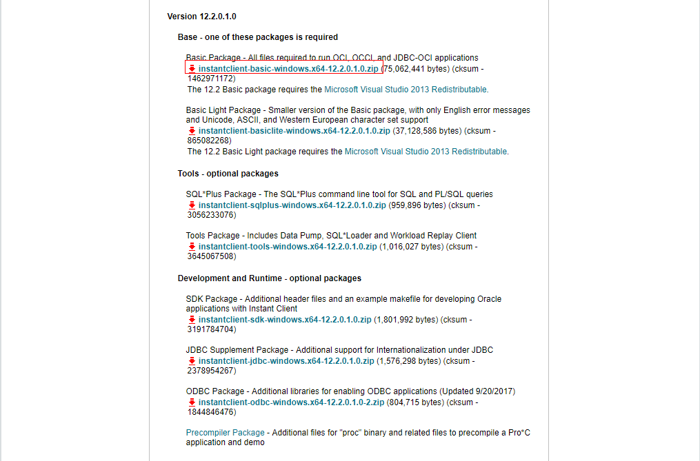
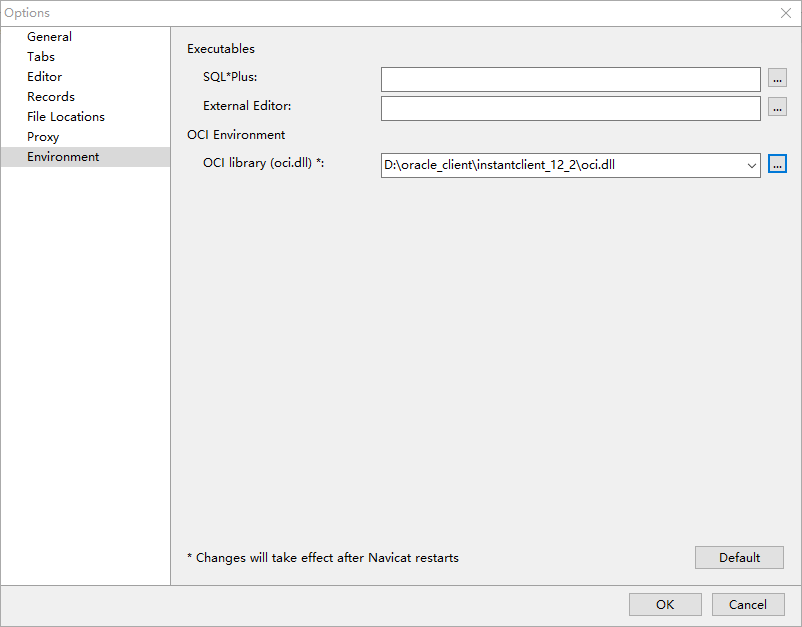
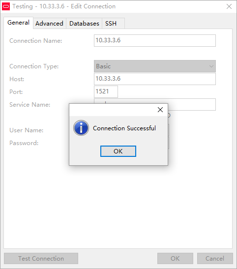

# 环境介绍
>  物理机
  * IP地址：172.30.59.50
  * 系统：win10
  * 客户端：Navicat Premium 12.0.23 64bit

  > 虚拟机
    * IP地址：10.33.3.6
    * 网络模式：NAT
    * 系统：win10
    * 数据库：Oracle 11g 64bit

# 目标
物理机通过Navicat Premium工具连接虚拟机中的Oracle数据库。

# 过程
1. 下载Oracle Instance Client，地址如下：[Oracle Instance Client](http://www.oracle.com/technetwork/topics/winx64soft-089540.html)，选择版本12.2.0.1.0



下载完成后解压zip文件到指定路径，最好不要带中文，本文路径为`D:\oracle_client`

2. 打开Navicat Premium，依次找到【工具】–【选项】–【Environment】-【OCI】，选择我们下载的Oracle Instance Client中oci.dll的文件路径



3. 修改Oracle安装目录下的listener.ora文件,路径`D:\app\aochong\product\11.2.0\dbhome_1\NETWORK\ADMIN\SAMPLE\LISTENER.ORA`，将HOST的值改为`0.0.0.0`

```win10
# listener.ora Network Configuration File: C:\app\oracle\product\11.2.0\dbhome_1\network\admin\listener.ora
# Generated by Oracle configuration tools.

SID_LIST_LISTENER =
  (SID_LIST =
    (SID_DESC =
      (SID_NAME = CLRExtProc)
      (ORACLE_HOME = C:\app\oracle\product\11.2.0\dbhome_1)
      (PROGRAM = extproc)
      (ENVS = "EXTPROC_DLLS=ONLY:C:\app\oracle\product\11.2.0\dbhome_1\bin\oraclr11.dll")
    )
  )

LISTENER =
  (DESCRIPTION_LIST =
    (DESCRIPTION =
      (ADDRESS = (PROTOCOL = IPC)(KEY = EXTPROC1521))
      (ADDRESS = (PROTOCOL = TCP)(HOST = 0.0.0.0)(PORT = 1521))
    )
  )

ADR_BASE_LISTENER = C:\app\oracle
```

4. 重启Oracle服务


5. 连接测试

