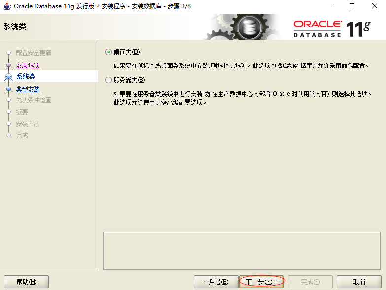
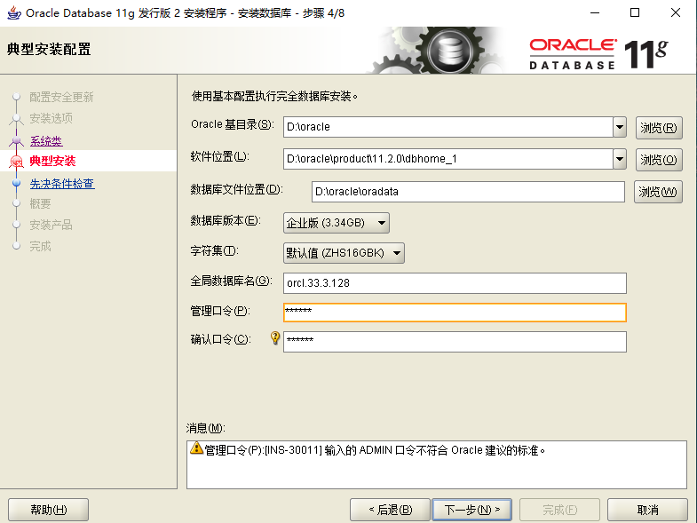
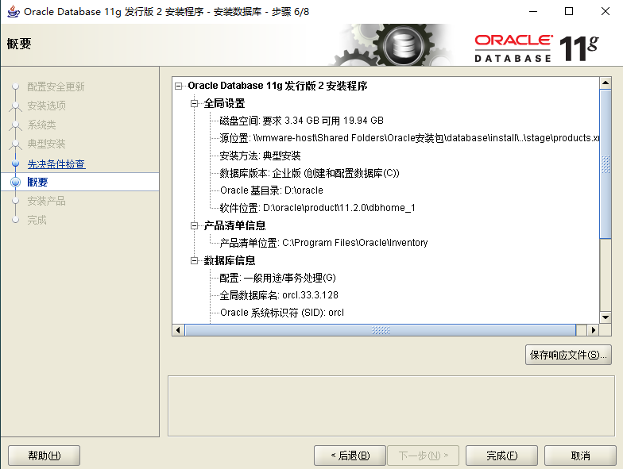
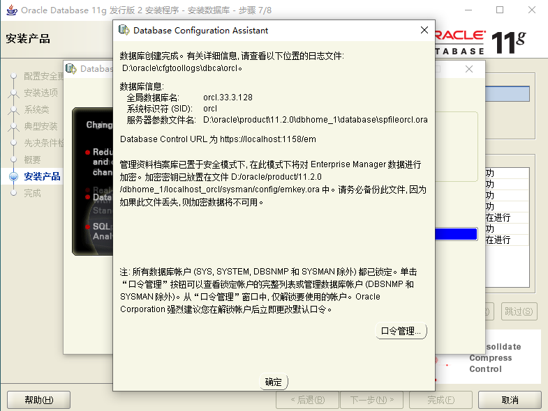
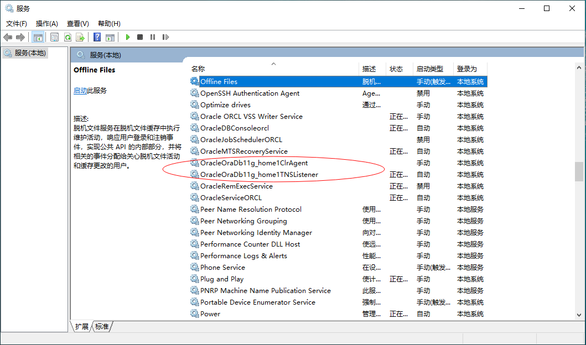

# Oracle个人学习使用（桌面版）

## 安装说明
> 最近学习Oracle，所以在Vm中配置一个win10的虚拟机来安装Oracle 11g，平时实验报告使用在虚拟机中使用SqlPlus，日常开发使用NaviCat进行连接，同时后期尝试安装多数据库和web服务搭建综合开发环境。

## 准备工作
### 下载
首先,使用浏览器搜索关键字  Oracle官网   , 然后进入官网.  为了避免不同浏览器的影响 ,这里给出官网链接地址:https://www.oracle.com

复制这个地址到浏览器地址栏,然后就可以进入官网了.

接着在官网界面右上角可以将语言调成中文.

点击试用和下载

然后找到  Donwnloads  ,点击下载.

优先勾选接受许可协议.

找到操作系统对应的位数.

到这里已经下载完成.

### 安装
**第一步：** 我们在合并的文件中选择setup.exe程序运行安装步骤，最好以管理员身份运行，避免安装在其他盘时出现权限不足而导致失败。

第二步：如图所示，我们可以选择填写电子邮件或不写，是否接受安全更新我们这里也选择不接受

第三步：点击下一步，安装程序会让你确认是否不接受安全更新，点击“是”。

第四步：安装选项中 根据自我需要选择，我们这里选择”创建和配置数据库“，然后“下一步”。

第五步：系统类中我们选择”桌面类“，接着“下一步

第六步：
在典型安装中，我们可以选择oracle的安装目录和数据库位置，等一系列位置选择，任何软件的安装我们首选一定不是系统盘，所以我们这里选择D盘，在D盘下建一个“oracle”文件夹，数据库版本我们选择企业版；（企业版的学习使用也是免费的），数据库名我们可以默认位“orcl”，管理口令根据自我习惯填写，oracle建议的密码是比较复杂的，这里我们选择密码也填写为“123456”方便记，不易忘记。然后点击“下一步”会提示口令不符建议标准是否继续安装，我们选择继续安装，忽略口令建议

第七步：

这里我们跳过先决条件的检查，因为不管先决条件的检查是否成功与否都不影响我们的数据库安装，所以在先决条件检查这项时我们都选择”下一步“。当然你的硬件条件要达标的前提下；

过了先决条件就是概要了，这里显示的是我们的安装信息，可以点“保存响应文件”保存下来，也可以不保存其实拿来没什么用。然后点“完成”；

接下来自动安装数据库，大概30分钟左右安装完毕

安装完成。

查看oracle服务,在的话表示安装完成了。

