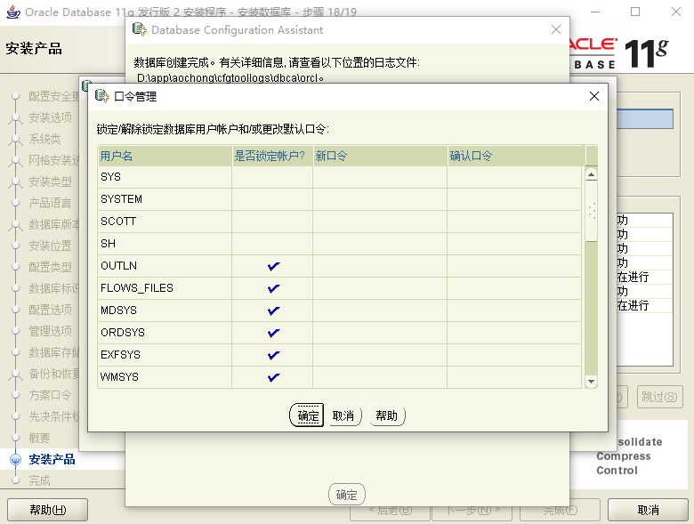
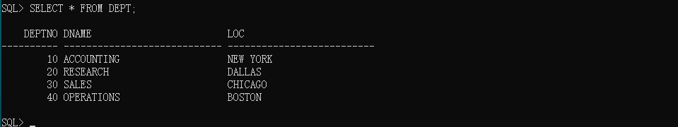

# 第一章：Oracle入门到精通

## 1 知识点
> 1. 如何进行Oracle数据库的下载与安装；
2. Oracle的主要的用户信息；
3. Oracle服务问题；
4. sqlplus基本操作命令；
5. DML、DDL语法结构；

## 2. 具体内容
### 2.1 Oracle简介
Oracle是现在世界上最大的专门提供办公平台的软件之一，另外一家公司就是微软。

> Oracle数据库的起源来自于IBM的一个分析员的论文 ————《论关系型数据库的发展》，于是根据这篇论文，当时Oracle的创始人：拉里-埃里森，开发了自己的数据库产品，之所以使用Oracle名称，是借用了希腊神话中的**“神谕”**，指的是上帝的宠儿，理解为神的指示。但是在中国从商周时期开始利用龟壳开始算命，于是在中国Oracle被翻译成甲骨文公司。

> Oracle一直是紧跟着IBM走，基本上IBM相关的技术战略Oracle都会积极参与。在钢铁侠3里面有一个情节：**“现在开始启用Oracle云服务”**。

> 后来Bruce Scott离开了Oracle公司，创办了属于自己的一个数据库：PointBase数据库。这个数据库在2005年的时候，当时BEA公司推出的WebLogic软件产品之中附赠的数据库产品。而后来BEA公司又被Oracle公司收购了。

为了纪念这位开发者，所以在Oracle数据库里面一直存在有**Scott**用户，并且他的密码也是一个公共密码：**tiger**

Oracle现在的产品线很丰富：UNIX、WebLogic中间件、Java编程语言、Oracle数据库。同时Oracle公式还提供了有自己的一系列产品：ERP、CRM系统。

而对于Oracle数据库，本次使用的是Oracle 11g产品，但是最新的是Oracle 12c产品。在软件开发行业，很少会去追新的技术。

###### 总结：
1. 了解一下Oracle创始人；
2. Oracle的产品线都是围绕着企业开发平台准备的。

### 2.2 Oracle安装与配置（服务版）
Oracle从现在的实际开发来讲，Oracle11g是使用比较多的，并且Oracle开发主要分为两类：
* 数据库管理：DBA
* 数据库编程：SQL编程、PL/SQL编程（子程序、触发器、面向对象、游标）。

首先,使用浏览器搜索关键字  Oracle官网   , 然后进入官网.  为了避免不同浏览器的影响 ,这里给出官网链接地址:https://www.oracle.com

复制这个地址到浏览器地址栏,然后就可以进入官网了.

接着在官网界面右上角可以将语言调成中文.


点击试用和下载


然后找到  Donwnloads  ,点击下载.


优先勾选接受许可协议.


找到操作系统对应的位数.


到这里已经下载完成.


但是在进行Oracle数据库安装前需要注意以下问题：
* 如果你电脑上有各种病毒防火墙，要先关闭；
* 在安装前请保证你的系统是健康的；


#### 安装
**第一步：** 我们在合并的文件中选择setup.exe程序运行安装步骤，最好以管理员身份运行，避免安装在其他盘时出现权限不足而导致失败。


第二步：如图所示，我们可以选择填写电子邮件或不写，是否接受安全更新我们这里也选择不接受


第三步：点击下一步，安装程序会让你确认是否不接受安全更新，点击“是”。


第四步：安装选项中 根据自我需要选择，我们这里选择”创建和配置数据库“，然后“下一步”。

Oracle本身只是一个平台，那么在这个平台上可以存在有若干个数据库，所以在进行Oracle安装的时候会询问用户是否要配置数据库。


为了生产环境准备，所以一定要选择服务器类。


在Oracle数据库里面，有一个比较牛的专业：IBM的 AIX + RAC。


在进行安装的时候请选择“高级配置”，配置编码、同时需要定义样本数据。


下一步

下一步

下一步

下一步

下一步

在配置数据库名称的时候会存在有一个sid的内容，这个指的是ServiceID，它的作用是进行数据库的网络连接使用的，一般情况下建议数据库名称与SID名称完全一致。

而后选择字符集为“UTF-8”编码。


勾选案例样本，否则就没有测试案例


下一步


下一步


下一步


在Oracle的数据库中会默认提供有若干个用户，每个用户有不同的权限，此处会询问是否为每一个用户分别定义密码，或者统一使用一个密码。为了方便统一设置密码为<mark>“admin”</mark>。


设置的密码不属于标准的密码格式，但是依然可以通过。


随后会进入到检测阶段，对于出现的问题可以忽略。


点击完成，进入安装，安装过程差不多持续30分钟。在安装完成之后会进入到数据库的权限配置（用户配置）。


在此处需要配置四个用户的密码：现在所配置的密码为通用密码。
* 超级管理员：sys/change_on_install
* 普通管理员：system/manager
* 普通用户：scott/tiger（是在选定了"样本"方案数据库之后）
* 大数据用户：sh/sh

进入到<mark>“口令管理”</mark>界面配置如上密码



Oracle安装已成功


#### Oracle服务
Oracle在使用过程之中必须启动系统服务，并且在Oracle安装完成之后会自动的配置如下的几个服务项：【计算机】 -> 【管理】 -> 【服务】


找到如下几个Oracle服务项


因为Oracle会占用大量的系统内存，所以对于Oracle数据库的服务建议手工启动。


在所有给出的服务之中有两个服务是最为重要的：
* OracleOraDb11g_home1**TNSListener**：监听服务，主要是留给客户端访问本机时所使用的的，例如程序开发的过程之中，需要连接数据库，如果此服务没有启动或者是错误，那么将导致程序无法连接。
* OracleServiceORCL：Oracle数据库的实例服务，在Oracle平台上可以同时配置有多个数据库，使用<mark>“C:\ProgramData\Microsoft\Windows\Start Menu\Programs\Oracle - OraDb11g_home1\配置和移植工具\Database Configuration Assistant”</mark>，这个工具可以建立更多的数据库，每一个数据库建立完成之后都会按照**“OracleServiceSID”**这样的
服务，如果要想使用ORCL数据库进行数据操作，那么此服务必须打开。

如果你现在只是通过本机进行数据库的连接操作，那么可以不用开启监听服务（非远程访问）。如果要访问，可以使用**“SQLPLUS”**命令完成。直接通过运行窗口输入即可

出现了如下乱码问题：cmd -- 属性 -- 选项 -- 勾选 ，使用旧版控制台（需要重新启动）


解决乱码问题：


如果要登录，则会出现一个提示信息，这个提示要求你输入用户名。但是在输入密码的时候，默认是不会进行回显操作的。不会使用**“*”**进行显示。


但是除了这种方式之外，也可以利用命令行的方式进行登录。命令行的启动可以使用**“cmd”**的命令完成。


只要能够进行登录，那么就表示现在的数据库以及可以正常使用了。

**总结：**在整个Oracle的安装过程之中，数据库名称（SID）的配置以及用户的配置是最为关键的部分。

### 2.3 SQLPlus命令
对于sqlplus命令实际上是很多的，本次只是对一些基本的命令进行一些说明，后面会慢慢接触到更多的命令。

现在Oracle是在有图形界面的系统上使用的，所以如果要想编写一些命令，那么可以直接在记事本上，随后将其粘贴到命令行之中。


1. 格式化操作
数据库本身会有一系列的数据表所组成，所谓的表指的就是行与列的集合。所以现在要想查看数据表的内容，则而言执行如下的语句：
`SELECT * FROM emp;`


对于此时的显示有以下的不满：
* 表格的显示格式非常的混乱；
* 所有的表格都会有一个标题行，对于标题行重复了很多次；

现在就需要针对于显示的内容进行优化：
* 设置每行显示的数据长度：`SET LINESIZE 300;`

* 设置每次显示的行数：`SET PAGESIZE 30;`


以上格式化的操作知识针对于数据库操作进行的，而实际的开发之中，都需要通过程序读取，所以这样的格式化没有意义。

但是以上的两个命令都是针对于整体显示的格式化，那么也可以针对于某一个列进行格式化的操作：
* 命令格式：`COL 列名称 FOR A长度数字`

##### 范例：格式化JOB列
`COL FOR JOB A10;`


2. 调用记事本
如果现在编写语句，那么直接在命令行方式下是很难完成的。有图形界面的时候这样的语句编写很容易，但是很多时候在没有图形界面下直接写就很累了，所以而言利用**"ed"**命令启动本机的记事本程序。

输入“ed hello”


在使用ed命令的时候如果不设置文件后缀，则默认启动的是使用的是**".sql"**的后缀，同时这个文件会保存在用户的目录下。用户可以直接在打开的记事本之中进行代码的编写、保存、执行。
```sql
SET LINESIZE 300;
SET PAGESIZE 30;
COL ENAME FOR A10;
COL JOB FOR A10;
SELECT * FROM emp;
```

如果要想执行文件，直接使用**"@文件名称即可"**,本次是**"@hello"**。利用**"@"**指令也可以调用磁盘上的文件，如果这个文件的后缀是**“*.sql”**也可以不用写后缀。


现在在D盘上提供有一个**“data.sql”**的文件。执行输入**“@d:data”**


3. 显示用户
在一个数据库之中会有多个操作用户，那么如果要想确认当前的用户是哪一位，则使用**“show user”**命令。如果要想进行不同用户的切换？则可以使用如下的命令完成：`CONN 用户名[/密码][AS SYSDBA]`

如果现在使用的是sys用户登录，这属于超级管理员，那么必须设置**“SYSDBA”**，否则无法登录。

##### 范例：切换到system用户
`CONN sys/manager`


如果使用sqlplus的时候不需要用户登录，则加一个**“/nolog”**的参数（sqlplus/nolog）


##### 范例：切换到sys（超级管理员用户）


使用`CONN sys/change_on_install AS SYSDBA`


在之前使用scott登录的时候查询到了emp表的信息，那么现在在sys下也进行查询。直接查询是无法查询到的，因为emp表属于scott用户，而其他用户如果要想访问其他用户的表，则要假如模式名称（Schema），现在一般都会将用户名称为模式。所以emp表的完整名称是**“scott.emp”**。


4. 调用本机程序
在sqlplus之中充分考虑到用户可能使用到的系统命令，所以提供有一个HOST指令，即：可以在HOST之后调用本机的程序执行，例如：现在要执行一个文件拷贝的程序，命令语法结构：**“copy 原始文件路径 拷贝目标文件路径”**；

假如说现在**"D"**盘有一个**"data.sql"**的文件，希望拷贝为**“hello.sql”**，所以可以执行如下命令：
```sql
COPY e:\data.sql e:\hello.sql
```
如果在sqlplus中调用，那么必须要保证其前面增加**“HOST”**
```sql
HOST COPY d:\data.sql d:\hello1.sql
```


### 2.4 SQL简介&数据表分析
#### 2.4.1 SQL简介
SQL是整个数据库操作的灵魂所在，对于所有的数据库都支持SQL语法，对于数据表的结构必须清楚的记住。

> SQL指的是结构化的查询语言，在70年代末到8年代初，世界上几乎有近80种数据库。但是就会出现了一个问题，不同的数据库有自己不同的操作语法，也就是说如果你会使用A数据库，那么如果现在切换到了B数据库上基本上就属于瞎子。后来IBM开发了一套标准的数据库操作语法，而全世界上只有Oracle数据库是最早提供这种语法支持的数据库。（现在看来当时的选择是正确的）由于SQL语句的标准推广，到了现在的时候就已经成为了数据库的标准技术，也就是说现在几乎所有的数据库都支持SQL语法。

> 整个的SQL语法之中实际上的组成只有20几个单词，但是在SQL大力发展的时代，还有一部分人就不使用SQL，这部分人认为SQL让他们丧失了自我的创造力。之后在整个行业之中就产生了NOSQL数据库（不使用SQL的数据库）。这一概念一直到大数据时代，NOSQL数据库火了，但是并不意味着不使用SQL的数据库，现在的NOSQL（Not Only SQL）.

对于SQL语句本身也分为若干个子类：
* DML（数据操作语言）：数据的更新与查询操作（SELECT、FROM、INSERT、GROUP BY、HAVING、WHERE、UPDATE、DELETE），在开发之中几乎都是以DML操作为主。
* DDL（数据定义语言）：数据库对象的定义语言，例如：数据表、约束、索引、同义词、用户，在数据库设计的时候都必须掌握；
* DCL（数据控制语言）：数据库的权限控制。

重点在于DML与DDL的学习上。

#### 2.4.2 Scott用户表
首先要想知道某一个用户（模式）所有的数据表，那么可以使用如下语法完成：
```sql
CONN scott/tiger;
SET LINESIZE 300;
SET PAGESIZE 30;
SELECT * FROM tab;
```
此时结果中一共返回了四张数据表。但是要想知道每一张表的结构，则而言使用**“DESC 表名称”**，例如要想知道dept表的结构，使用**“DESC dept”**。

1. 部门表：dept

| No  | 列名称 | 类型         | 描述                         |
| --- | ------ | ------------ | ---------------------------- |
| 1   | DEPTNO | NUMBER(2)    | 部门编号，最多由两位数字组成 |
| 2   | DNAME  | VARCHAR2(14) | 部门名称，由14位字符所组成   |
| 3   | LOC    | VARCHAR2(13) | 部门位置                     |



2. 雇员表：emp

| No  | 列名称   | 类型         | 描述                                 |
| --- | -------- | ------------ | ------------------------------------ |
| 1   | EMPNO    | NUMBER(4)    | 雇员编号，最多只能包含4位数字        |
| 2   | ENAME    | VARCHAR2(10) | 雇员名称                             |
| 3   | JOB      | VARCHAR2(9)  | 雇员职位                             |
| 4   | MGR      | NUMBER(4)    | 领导编号，领导也属于雇员             |
| 5   | HIREDATE | DATE         | 雇佣日期                             |
| 6   | SAL      | NUMBER(7,2)  | 基本工资，小数位最多是2位，整数位5位 |
| 7   | COMM     | NUMBER(7,2)  | 佣金，销售人员才具备佣金             |
| 8   | DEPTNO   | NUMBER(2)    | 所属部门编号                         |


3. 工资登记表：salgrade

| No  | 列名称 | 类型   | 描述             |
| --- | ------ | ------ | ---------------- |
| 1   | GRADE  | NUMBER | 工资等级编号     |
| 2   | LOSAL  | NUMBER | 此等级的最低工资 |
| 3   | HISAL  | NUMBER | 此等级的最高工资 |


4. 工资表：bonus

| No  | 列名称 | 类型         | 描述     |
| --- | ------ | ------------ | -------- |
| 1   | ENAME  | VARCHAR2(10) | 雇员姓名 |
| 2   | JOB    | VARCHAR2(9)  | 雇员职位 |
| 3   | SAL    | NUMBER       | 工资     |
| 4   | COMM   | NUMBER       | 佣金     |


在bonus表中现在没有任何的数据。

##### 总结：
1. 查看某一个用户全部数据表的命令；
2. 查看表结构的命令；
3. dept、emp、salgrade三张表的结构以及字段的意义；

## 3. 知识点总结
1. Oracle的发展历史；
2. ORACLE的安装与配置；
3. sqlplus基本命令的使用；
4. DDL、DML语法结构的记忆；
