# Windows卸载Oracle Oracle11g

#### 以下操作供参考:完全卸载oracle11g步骤：
**第一步：** 停止”服务”中所有关于Oracle数据库服务。
切记:删除Oracle数据库，此文只是借鉴，因为每个人的删除数据库的时候，不可避免的出现与本文不一样的突发情况，新手删除数据库的需要勇气，大不了重装电脑系统。

进入服务的方法很多，如：
(1)在运行中输入services.msc,然后找到所有跟Oracle有关的服务，并且停掉这些服务。

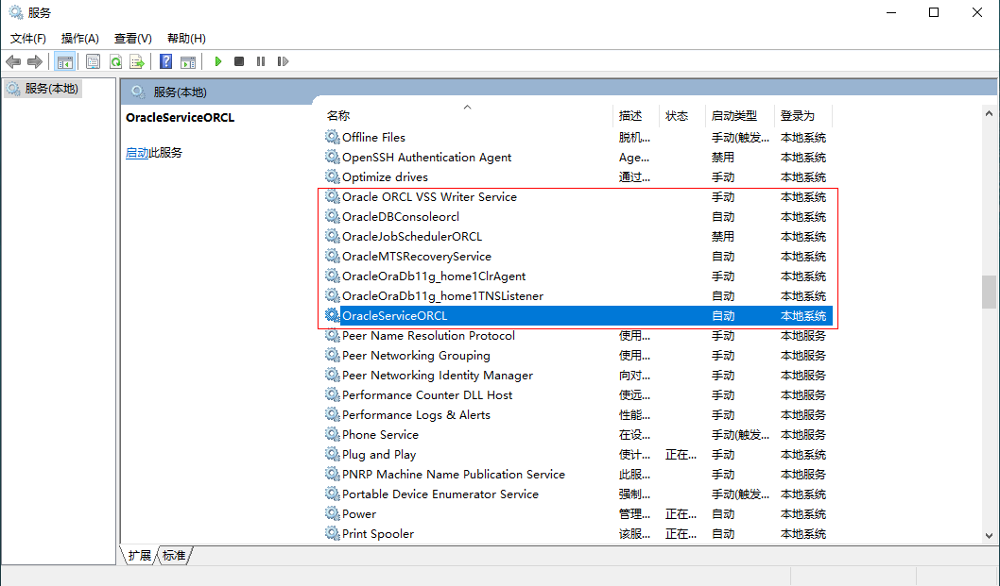

**第二步：** 运行deinstall.bat
找到你安装Oracle数据库所在的物理路径，我的安装路径是：<mark>D:\oracle\product\11.2.0\dbhome_1\deinstall\deinstall.bat</mark>，然后找到deinstall.bat这个Windows批处理文件，并且**右击管理员模式运行**。
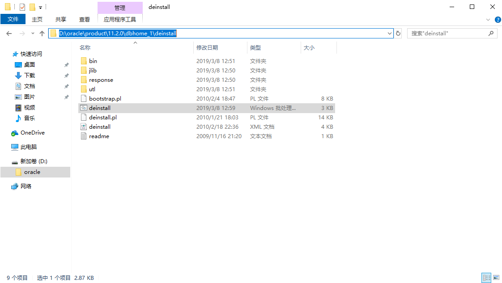

**第三步：** Doc界面具体命令运行
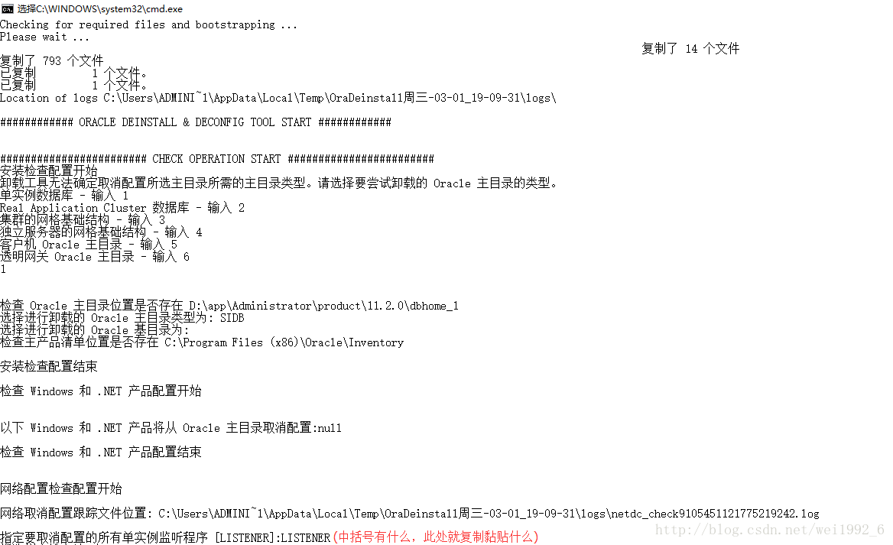

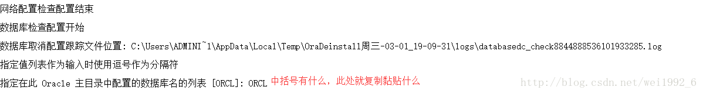

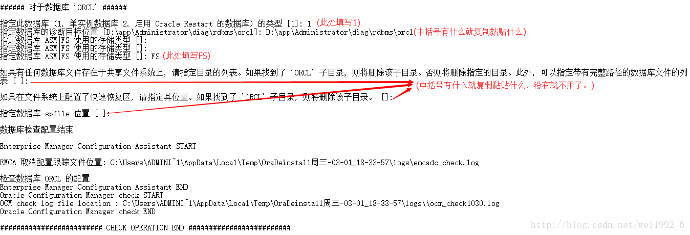

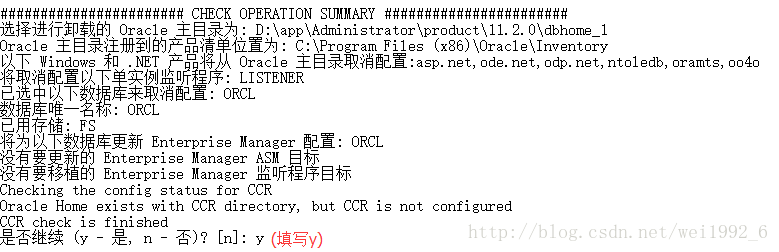

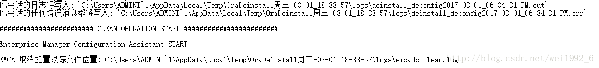

**第四步：** 删除注册表，运行regedit
(1)选择HKEY_LOCAL_MACHINE\SOFTWARE\ORACLE，按del键删除这个入口,如果没有就不用删了；
(2)选择HKEY_LOCAL_MACHINE\SYSTEM\CurrentControlSet\Services，滚动这个列表，删除所有Oracle入口；

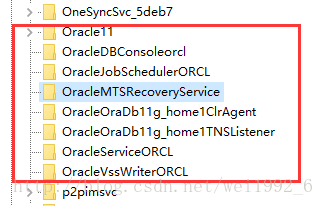

(3)选择HKEY_LOCAL_MACHINE\SYSTEM\CurrentControlSet\Services\EventLog\Application，滚动这个列表，删除所有Oracle入口；

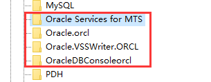

**第五步：** 删除其余文件
(1)删除Oracle所有组件，删除这个文件夹的所有东西，C:\ProgramData\Microsoft\Windows\StartMenu\Programs\Oracle-OraDb11g_home1；

(2)删除环境变量中系统变量为Path中包含Oracle的变量值，此处不一定为标准，看个人的环境配置；

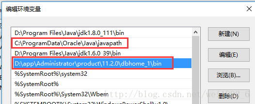

(3)删除文件，此处不描述，具体的看图操作；

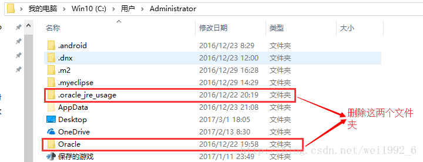

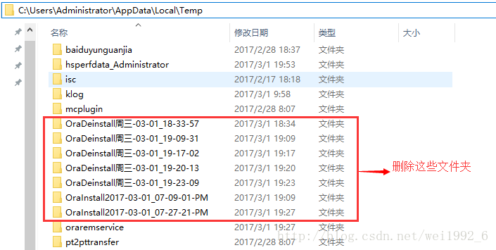

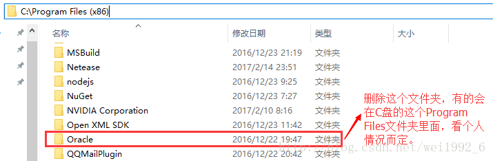

(4)最重要的一点，看过很多人卸载Oracle数据库的时候都没有删除这个；

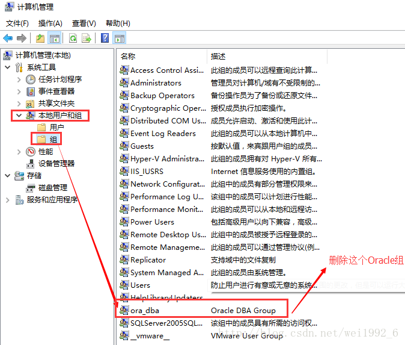

**第六步：** 最后重启电脑。
