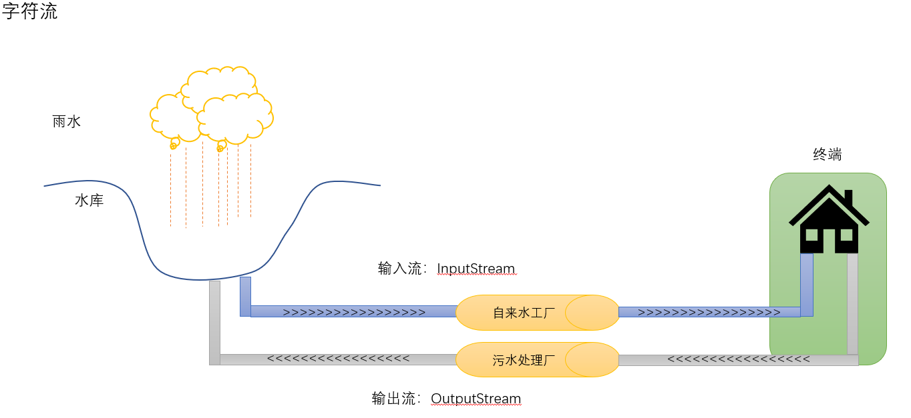
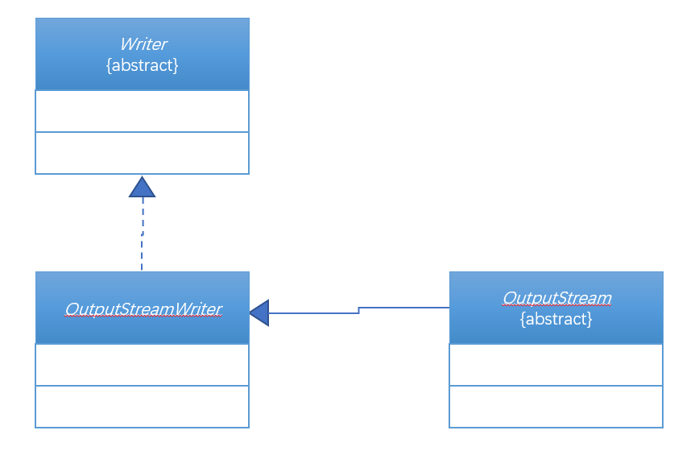
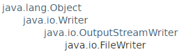
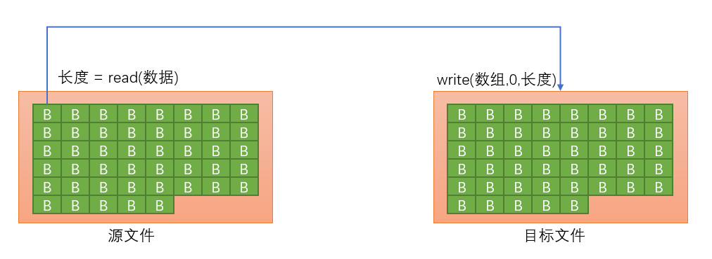

# 第四十六章：字节流与字符流

## 1.知识点
> 1. 字节输出流：OutputStream
2. 字节输入流：InputStream基本使用；
3. 字符输出流：Writer基本使用；
4. 字符输入流：Reader基本使用；
5. 转换流操作；
6. 实现文件的拷贝操作；

## 2.具体内容
如果要进行文件内容的操作那么必须依靠数据流完成，而数据流主要分为两种：
* 字节流：InputStream(字节输入流)、OputputStream（字节输出流）；
* 字符流：Reader(字符输入流)、Writer(字符输出流)；

### 2.1 数据流的模式与划分
流在现实生活中也是存在的，例如：水流、电流。就以居民水库用水的概念来观察流的操作：
* 按照字节流的方式来描述

* 按照字符流的方式来描述


字符要比字节处理的更多一些，但是不管使用的是字节流还是字符流，其基本的操作流程都是一样的，以文件操作为例：
* 创建File类对象，主要是指明要操作的文件路径；
* 通过字节流或字符流的子类为父类实例化；
* 进行文件的读、写操作；
* 关闭数据流（close()）；

### 2.2 字节输出流：OutputStream
字节输出流主要是以操作byte数据为主的，首先来观察java.io.OutputStream类的定义结构：`public abstract class OutputStream extends Object implements Closeable, Flushable`，首先发现OuptputStream类中实现了两个接口：Closeable、Flushable。
**类接口关系如下：**


最早在使用OutputStream类操作的时候还没有Closeable或Flushable，所以对于这两个接口基本上就可以忽略了，而除了close()与flush()两个方法之外，还定义有三个重要的输出操作方法：
* 输出单个字节：`public abstract void write(int b) throws IOException`
* 输出全部字节数组：`public abstract void write(int b) throws IOException`
* 输出部分字节数组：`public void write(byte[] b,int off,int len) throws IOException`

但是OutputStram是一个抽象类，那么按照抽象类的基本原则来讲，如果要想取得OutputStream类的实例化对象那么一定需要依靠子类，如果要进行文件的输出操作则可以使用FileOutputStream，在这个类中提供有两个常用构造方法：
* 构造方法：`public FileOutputStream(File file) throws FileNotFoundException`，覆盖文件；
* 构造方法：`public FileOutputStream(File file,boolean append) throws FileNotFoundException`，追加文件；

##### 范例：实现文件的输出
```java
public class TestDemo4 {
    public static void main(String[] args) throws Exception{
        //第一步：定义要输出文件的File类对象
        File file = new File("E:"+File.separator + "File" + File.separator + "test.txt");
        //第二步：利用OutputStream的子类为父类进行实例化
        OutputStream output = new FileOutputStream(file);
        //第三步：输出文字信息
        String msg = "按施工的高科技的时刻是会是加快结婚不看机会";
        //为了方便输出需要将字符串变为字节数组
        byte[] data = msg.getBytes();
        output.write(data);
        output.close();
    }
}
```
那么在进行输出的时候也可以只输出部分内容。
```java
output.write(data,0,12);
```
或者还可以使用循环的方式进行单个字节的信息输出。
```java
for(int x=0;x<data.length;x++){
  output.write(data[x]);
}
```
但是现在发现，每当执行完成之后所以的内容都被覆盖了，所以也可以进行数据内容的追加操作。

##### 范例：追加数据
```java
OutputStream output = new FileOutputStream(file,true);
```
如果要想进行换行操作，则可以使用**"\r\n"**表示。
```java
public class TestDemo4 {
    public static void main(String[] args) throws Exception{
        //第一步：定义要输出文件的File类对象
        File file = new File("E:"+File.separator + "File" + File.separator + "test.txt");
        //第二步：利用OutputStream的子类为父类进行实例化
        OutputStream output = new FileOutputStream(file,true);
        //第三步：输出文字信息
        String msg = "按施工的高科技的时刻是会是加快结婚不看机会\r\n";
        //为了方便输出需要将字符串变为字节数组
        byte[] data = msg.getBytes();
        for(int x=0;x<data.length;x++){
            output.write(data[x]);
        }
        output.close();
    }
}
```

### 2.3 字节输入流：InputStream
InputStram可以实现数据的读取操作，在Java中InputStream类的定义：
`public abstract class InputStream extends Object implements Closeable`


在InputStream类中定义有三个数据的读取操作方法：
* 读取单个字节：`public abstract int read() throws IOException`，每次执行此方法将读取单个字节数据，如果已经读取完成了，那么最后返回的是-1；


* 读取数据到字节数组：`public int read(byte[] b) throws IOException`，每次将数据读取到数组之中，那么会返回一个读取长度的数据，如果没有数据则返回的长度为-1，但是要考虑两种情况：
  * 要读取的内容大于开辟的数组内容，长度就是整个数组的长度；
  * 要读取的内容小于开辟的数组内容，长度就是全部最后的内容长度，数组装不满；


* 读取部分内容到字节数组：`public int read(byte[] b,int off,int len) throws IOException`，每次读取内容到部分字节数组，只允许读取满限制的数组的字节个数，此方法依然会返回读取的长度；

整个操作跟输出的形式几乎是相同的，参数类型及作用也几乎是相同的。
InputStream是一个抽象类，所以要进行文件的读取使用FileInputStream子类，子类定义的构造方法如下：
* 构造方法：`public FileInputStream(File file) throws FileNotFoundException`

##### 范例：实现数据读取
```java
public class TestDemo5 {
    public static void main(String[] args) throws Exception{
        //第一步：定义要输出文件的File类对象
        File file = new File("E:"+File.separator + "File" + File.separator + "test.txt");
        //第二步：利用OutputStream的子类为父类进行实例化
        InputStream input = new FileInputStream(file);
        //第三步：实现数据的读取操作
        byte[] data = new byte[1024];
        input.read(data);
        System.out.println("读取的内容【"+new String(data)+"】");
        input.close();
    }
}
```
在InputStream类中提供有一个read()方法，这个方法可以实现单个字节数据的读取操作，于是下面利用循环的方法采用此方法实现单个字节数据的读取。
##### 范例：读取单个字节
```java
public class TestDemo6 {
    public static void main(String[] args) throws Exception{
        //第一步：定义要输出文件的File类对象
        File file = new File("E:"+File.separator + "File" + File.separator + "test.txt");
        //第二步：利用OutputStream的子类为父类进行实例化
        InputStream input = new FileInputStream(file);
        //第三步：实现数据的读取操作
        byte[] data = new byte[1024];
        int foot = 0;
        int temp = 0;
        do{
            temp = input.read();
            if(temp != -1){
                data[foot ++] = (byte) temp;
            }
        }while(temp != -1);
        System.out.println("读取的内容【"+new String(data,0,foot)+"】");
        input.close();
    }
}
```
以上使用的是do..while循环操作，的确是进行了数据的读取，但是太麻烦了，所以在所以的实际的开发过程之中都会利用while循环实现读取操作。
##### 范例：利用while循环修改以上代码
```java
public class TestDemo7 {
    public static void main(String[] args) throws Exception{
        //第一步：定义要输出文件的File类对象
        File file = new File("E:"+File.separator + "File" + File.separator + "test.txt");
        //第二步：利用OutputStream的子类为父类进行实例化
        InputStream input = new FileInputStream(file);
        //第三步：实现数据的读取操作
        byte[] data = new byte[1024];
        int foot = 0;
        int temp = 0;
        while((temp = input.read()) != -1){
            data[foot++] = (byte) temp;
        }
        System.out.println("读取的内容【"+new String(data,0,foot)+"】");
        input.close();
    }
}
```
以上这样的循环读取的过程才是开发中使用最多的形式。

### 2.4 字符输出流：Writer
Writer是进行字符输出操作使用的类，这个类属于抽象类，观察定义：
`public abstract class Writer extends Object implements Appendable, Closeable, Flushable`，之所以会提供一个Writer类主要是因为这个类的输出方法有一个特别好用：
* 输出字符串：`public void write(String str) throws IOException`;

Writer是一个抽象类，要进行文件字符流操作，应该使用Writer子类FileWriter，里面一定有一个构造方法：`public FileWriter(File file)`

##### 范例：使用Writer输出数据
```java
public class TestDemo8 {
    public static void main(String[] args) throws Exception{
        File file = new File("E:"+File.separator + "File" + File.separator + "test.txt");
        if(!file.getParentFile().exists()){
            file.getParentFile().mkdirs();
        }
        Writer writer = new FileWriter(file);
        String msg = "发噶数控技术卡萨覅粉红色会计法还是我刚刚\r\n";
        writer.write(msg);
        writer.close();
    }
}
```
虽然Writer类提供有字符数组的输出操作能力，但是从本质上来讲使用Writer类就意味着要执行字符串的直接输出。**字符流是最适合操作中文的，但并不意味着字节流就无法操作中文。**

### 2.5 字符输入流：Reader
Reader一定是一个抽象类，观察定义：`public abstract class Reader extends Object implements Readable, Closeable`，在Reader类中也提供有一系列的rerad()方法：
* 数据读取：`public int read(char[] cbuf) throws IOException`

##### 范例：读取数据
```java
public class TestDemo9 {
    public static void main(String[] args) throws Exception{
        File file = new File("E:"+File.separator + "File" + File.separator + "test.txt");
        if(file.exists()){
            Reader in = new FileReader(file);
            char[] data = new char[1024];
            int len = in.read(data);
            System.out.println(new String(data,0,len));
            in.close();
        }
    }
}
```
Reader与InputStream类相比除了数据类型的差别之外，操作上没有优势。

### 2.6 字节流与字符流的区别
这两种流的区别就好比数据库中的BLOB与CLOB的区别？
* CLOB保存大文本数据，字符数据；
* BOLB保存二进制数据，例如：电影、图片、文字、字节数据；

首先必须要明确一点，通过任何终端（网络、文件）读取或者输出的数据都一定是字节，但是字符是经过内存处理后的数据。
* 字符输入：字节（磁盘）自动转换为字符（内存）；
* 字符输出：字符（内存）自动转换为字节（磁盘）；

在利用字符流输出的时候，所以的内容实际上都只是输出到了缓冲区中（内存），在使用close()方法关闭的时候会将缓冲区的数据进行输出，如果没有关闭，那么就将无法进行输出，此时就可以利用flush()进行强制刷新。

```java
public class TestDemo8 {
    public static void main(String[] args) throws Exception{
        File file = new File("E:"+File.separator + "File" + File.separator + "test.txt");
        if(!file.getParentFile().exists()){
            file.getParentFile().mkdirs();
        }
        Writer writer = new FileWriter(file,true);
        String msg = "发噶数控技术卡萨覅粉红色会计法还是我刚刚\r\n";
        writer.write(msg);
        writer.flush();
//        writer.close();
    }
}
```
字符使用到了缓冲区，而字节流没有使用到缓冲区，如果处理中文使用字符流，其他的任何数据都使用字节流。

###### 总结：
1. OutputStream类
  * 输出部分字节数组：`public void write(byte[] b,int off,int len) throws IOException`；
2. InputStream类
  * 读取数据到字节数组：`public int read(byte[] b) throws IOException`；
3. Writer类
  * 输出字符串：`public void write(String str) throws IOException`；

### 2.7 转换流
在薪资给出的字节流与字符流的操作之中，可以发现是各有特点，为此，在Java里面提供了两个转换的流：InputStreamReader、OutputStreamWriter。

观察这两个类定义的结构以及构造方法：

| InputStreramReader                                 | OutputStreamWruter                                 |
| -------------------------------------------------- | -------------------------------------------------- |
| public class InputStreamReader extends Reader      | public class OutputStreamWriter extends Writer     |
| public InputStreamReader(InputStream in)           | public OutputStreamWriter(OutputStream out)        |
|  |  |

也就是说利用InputStreamReader类可以接收InputStream类对象，而后向上转型为Reader类对象；利用OutputStreamWriter类可以接收OutputStream类对象，而后向上转型为Writer类对象。

##### 范例：观察转型操作
```java
public class TestDemo10 {
    public static void main(String[] args) throws Exception{
        File file = new File("E:"+File.separator + "File" + File.separator + "test.txt");
        if(file.exists()){
            OutputStream out = new FileOutputStream(file);
            Writer  writer = new OutputStreamWriter(out);
            String msg = "Hello World!!!";
            writer.write(msg);
            writer.close();
            out.close();
        }
    }
}
```
实际上这种转换流不在于使用，而在于进一步观察类的继承结构。
1. FileInputStream、FileOutputStream

| FileInputStream                                    | FileOutputStream                                   |
| -------------------------------------------------- | -------------------------------------------------- |
|  |  |


2. FileReader 、FileWriter

| FileReader                                         | FileWriter                                         |
| -------------------------------------------------- | -------------------------------------------------- |
|  |  |


通过观察，发现FileReader与FileWriter都是需要经过转换的。通过定义结构也可以看见，因为真正保存在磁盘上的数据一定是字节数据。

###### 总结：字节流与字符流之间是可以实现互相转换的，字符流一定是在内存在经过处理得来的。

### 2.8 综合实战：文件拷贝
编写一个文件的拷贝程序，可以实现任意的文件拷贝操作，通过初始化参数输入拷贝的源文件路径以及拷贝的目标文件路径，本程序暂时不考虑类的设计。
* 拷贝命令：**"copy e:\my.jpg e:\hello.jpg"**；

如果要实现这种拷贝的操作，可以由如下两种实现思路：
* 思路一：开辟一个数组，将所需要拷贝的内容读取到数组之中，而后一次性输出到目标路径中；
* 思路二：采用边读边写的方式进行拷贝，不是一次性读取。

第一种方式的问题在于，如果文件量小没有问题（5M），如果文件量一大，基本上内存就被占满了。

##### 范例：初期实现
```java
public class FileCopy {
    public static void main(String[] args) throws IOException {
        //如果要执行拷贝命令，则必须通过初始化参数传递源文件路径以及目标文件路径
        if(args.length != 2){
            System.out.println("错误的命令，格式为：CopyDemo 源文件路径 目标文件路径");
            System.exit(1);
        }
        //如果现在有参数了，还需要验证源文件是否存在
        File sourcePath = new File(args[0]);
        if(!sourcePath.exists()){
            System.out.println("路径错误，请确定源文件路径");
            System.exit(1);
        }
        //如果拷贝文件存在
        File targetPath = new File(args[1]);
        if(targetPath.exists()){
            System.out.println("拷贝的路径以及存在，请更换目标路径");
            System.exit(1);
        }
        long start = System.currentTimeMillis();
        InputStream in = new FileInputStream(sourcePath);
        OutputStream out = new FileOutputStream(targetPath);
        copy(in,out);
        System.out.println("拷贝时长：" + (System.currentTimeMillis() - start)/1000 + "秒");
    }

    public static void copy(InputStream inFile, OutputStream outFile) throws IOException {
        int temp = 0;
        while((temp = inFile.read()) != -1){
            outFile.write(temp);
        }
    }
}
```
现在实现了拷贝操作，但是这样的拷贝操作太慢了无法忍受。因为如果每次只拷贝单个字节，不可能的事情，可以利用数组来提升拷贝的性能。可以将数据读取到数组中，而后一次性将数组输出。



##### 范例：修改拷贝方法
```java
public static void copy(InputStream inFile, OutputStream outFile) throws IOException {
        int temp = 0;
        byte[] data = new byte[2048];
        while((temp = inFile.read(data)) != -1){
            outFile.write(data,0,temp);
        }
    }
```

对于FileInputStream、OutputStream的最直接操作就体现在本程序之中。

## 3. 知识点总结
日后学习Struts、Spring MVC、文件上传的操作就会了。
