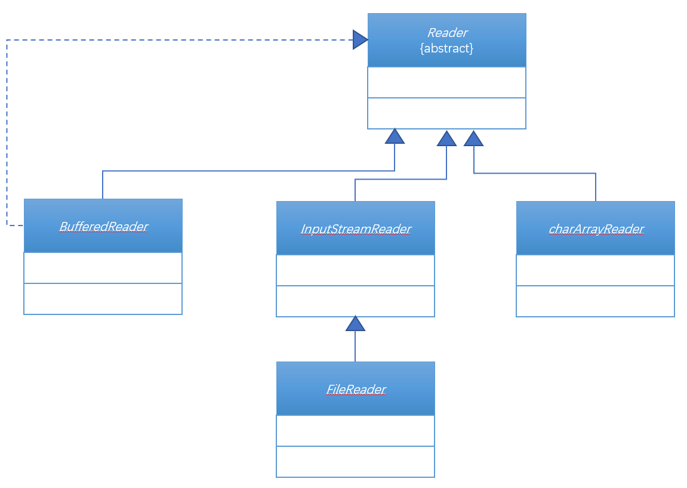

# 第五十一章：IO高级应用

## 1. 知识点
> BufferedReader类的使用；

## 2. 具体内容
> 在JDK1.5之前，BufferedReader类是一个非常重要的数据读取的操作类，也就是说如果要进行输入流的操作尤其是文字操作，都建议使用BufferedReader类完成。

### 2.1 缓冲输入流
BufferedReader类属于Reader的子类，负责进行缓冲区读取，由于其本身属于字符输入流，所以更加适合于中文文字信息。

下面来观察BufferedReader类的继承结构：



在BufferedReader类中提供有两个重要方法：
* 构造方法：`public BufferedReader(Reader in)`；
* 数据读取方法：`public String readLine() throws IOException`；

##### 范例：BufferedReader实现数据输入
* 数据输入要使用System.in，而System.in是InputStream类型；
* BufferedReader类的构造器需要Reader类型，那么需要将字节输入流变为字符输入流，使用InputStreamReader。

```java
public class TestDemo23 {
    public static void main(String[] args) throws IOException {
        BufferedReader br = new BufferedReader(new InputStreamReader(System.in));
        System.out.println("请输入文字：");
        String str = br.readLine();
        System.out.println("输入的信息为：" + str);
    }
}
```

虽然以上的代码已经成功的实现了键盘输入数据，并且也而言直接按照字符串返回，不过这种实例化对象进行转换的操作实在是不可取。

现在有了BufferedReader类对象，那么之后就可以进行一些输入验证的操作了。**要求:** 输入年龄，如果输入的不是数字，则提示错误。
```java
public class TestDemo24 {
    public static void main(String[] args) throws IOException {
        BufferedReader br = new BufferedReader(new InputStreamReader(System.in));
        boolean flag = true;
        while(flag){
            System.out.println("请输入年龄：");
            String str = br.readLine();
            if(str.matches("\\d+")){
                System.out.println("输入的信息为：" + str);
                flag = false;
            }else{
                System.out.println("请输入正确的年龄!");

            }
        }
    }
}
```
以上的代码都是围绕着键盘输入数据的操作进行的，不过使用BufferedReader类还有一个好处，就是大文本数据的读取。

##### 范例：利用BufferedReader读取文件信息
```java
public class TestDemo25 {
    public static void main(String[] args) throws IOException {
        BufferedReader br = new BufferedReader(new FileReader(new File("E:" + File.separator + "word.txt")));
        String str = null;
        while((str = br.readLine()) != null){
            System.out.println(str);
        }
        br.close();
    }
}
```
但是遗憾的是，虽然BufferedReader类如此的好用，但是在输入数据的时候它已经不是首选了，而是次要选择。

### 2.2 Scanner扫描流
从JDK1.5之后提供了一个java.util.Scanner类。而Scanner类称为扫描流，首先需要观察的是它的构造方法：
* 构造方法：`public Scanner(InputStream source)`；

当取得了Scanner类的实例化对象之后，那么下面就可以进行数据的读取操作，但是读取操作往往需要一堆组合：
* 判断是否有输入数据：`public boolean hasNext()`；
* 取出数据：`public String next()`；

Scanner类中默认最古老的的支持就是利用String来接收数据，可是很多时候这样的操作可能并不方便，因为输入的内容可能是数字，或者输入的内容还需要进行一些验证。那么在这种情况下发生了一些变化，增加了一堆的hasNext()和next()方法。

##### 范例：利用Scanner类读取键盘数据
```java
public class TestDemo26 {
    public static void main(String[] args) {
        Scanner sc = new Scanner(System.in);
        System.out.println("请输入信息：");
        if(sc.hasNext()){
            System.out.println("输入内容为：" + sc.next());
        }
        sc.close();
    }
}
```
但是默认情况下Scanner会将弄个和换行做诶读取分隔符，所以要想改变这一问题，就需要设置分隔符。
* 设置分隔符：`public Scanner useDelimiter(String pattern)`；

```java
Scanner sc = new Scanner(System.in);
sc.useDelimiter("\n");
```
Scanner本身支持各种数据类型。

##### 范例：设置年龄输入
```java
public class TestDemo27 {
    public static void main(String[] args) {
        Scanner sc = new Scanner(System.in);
        sc.useDelimiter("\n");
        System.out.println("请输入年龄：");
        if (sc.hasNextInt()) {
            System.out.println("输入内容为：" + sc.nextInt());
        } else {
            System.out.println("输入的年龄有误！！！");
        }
        sc.close();
    }
}
```
但是至少有一点比较欣慰，因为Scanner支持正则的判断。

##### 范例：要求输入一个人的生日
```java
public class TestDemo28 {
    public static void main(String[] args) {
        Scanner sc = new Scanner(System.in);
        sc.useDelimiter("\n");
        System.out.println("请输入生日：");
        if (sc.hasNext("\\d{4}-\\d{2}-\\d{2}")) {
            System.out.println("输入生日为：" + sc.next("\\d{4}-\\d{2}-\\d{2}"));
        } else {
            System.out.println("输入的生日有误！！！");
        }
        sc.close();
    }
}
```
以上只是用键盘输入数据做了一个Scanner功能的演示，以上的操作意义不大。

##### 范例：利用Scanner读取文件
```java
public class TestDemo29 {
    public static void main(String[] args) throws IOException {
        Scanner sc = new Scanner(new FileInputStream(new File("E:" + File.separator + "word.txt")));
        sc.useDelimiter("\n");
        while(sc.hasNext()){
            System.out.println(sc.next());
        }
        sc.close();
    }
}
```
Scanner读取数据操作要比InputStream容易，比BufferedReader类的实例化操作简单。

## 3. 知识点总结
> 1. BufferedReader使用的是缓冲数据读取操作，其读取方式主要依靠readLine()方法，此方法将读入的数据以String形式返回，适合于正则操作，或者向其他数据类型转换。
2. 程序输出信息使用PrintStream(PintWriter)、而程序输入数据使用Scanner(BufferedReader)；
