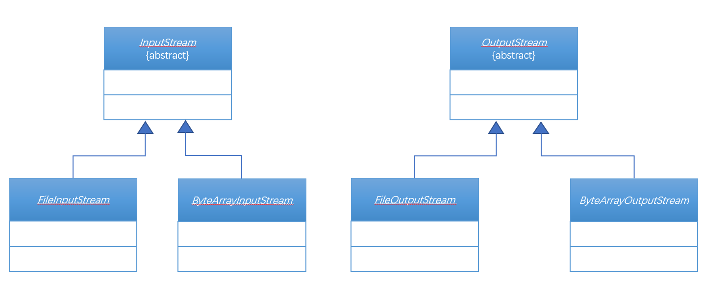
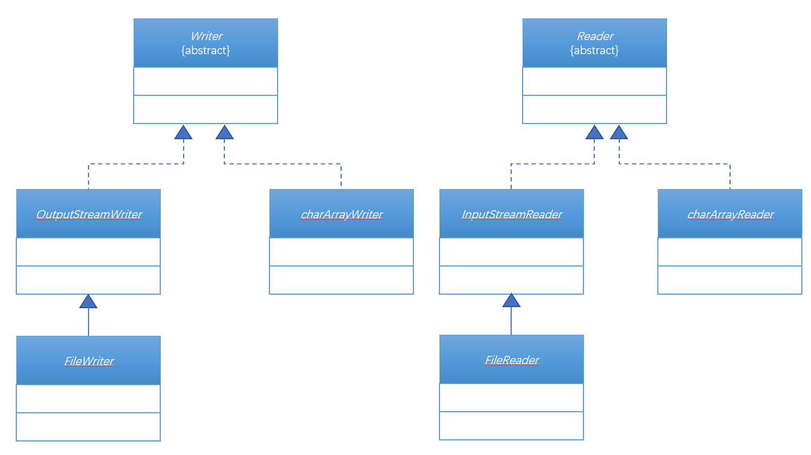

# 第四十八章：内存流

## 1. 知识点
> 1. 内存操作流的划分；
2. 内存操作流的使用；

## 2. 具体内容
### 2.1 内存流基本操作
对于IO操作，到现在为止只学习了一种文件流的操作。这种操作的特点都是需要以文件为终端进行开发处理的，但是现在的开发之中如果说不希望你产生文件，但是依然需要你使用IO操作。那么此时就可以利用内存作为操作的终端。

在Java中内存流一共分为两组：
* 字节内存流：ByteArrayInputStream、ByteArrayOutputStream;


* 字符内存流：charArrayWriter、charArrayReader；


本次使用的是字节内存流，同时需要做一个说明：
* 以文件操作为例，以PC作为输出输入端，文件作为终端：
  * 程序 > OutputStream > 文件；
  * 程序 < InputStream < 文件；
* 以内存操作为例 ，以PC作为输出输入端，内存作为终端：
  * 程序 > InputStream > 内存；
  * 程序 < OutputStream < 内存；

下面来观察构造方法：
* ByteArrayInputStream：`public ByteArrayInputStream(byte[] buf)`，此处相当于告诉ByteArrayInputStreram，你实例化好之后就有了一些数据，这些数据是程序给的；
* ByteArrayOutputStream：`public ByteArrayOutputStream()`，通过内存把内存输出；

##### 范例：实现内存流操作
```java
public class TestDemo13 {
    public static void main(String[] args) throws IOException {
        //实现小写操作
        String msg = "Hello World! . Very Good .";
        //将所有数据保存在内存流之中，利用ByteArrayInputStream
        InputStream in = new ByteArrayInputStream(msg.getBytes());
        //如果要通过内存读取数据，使用ByteOutputStream
        OutputStream out = new ByteOutputStream();
        //Character类提供了转大写或小写的一个方法:public static int toLowerCase(int codePoint)
        int temp = 0;
        while((temp = in.read()) != -1){
            out.write(Character.toLowerCase(temp));
        }
        System.out.println(out);
        in.close();
        out.close();
    }
}

```
整个操作过程之中发生了IO执行，但是没有文件产生。

### 2.2 利用内存流合并文件
正常来讲，肯定是子类为父类对象实例化，而后利用父类对象根据父类的标准进行IO操作。例如：OutputStream、InputStream类的方法就是write()、read()。但是也需要知道所有的子类都是有自己方法扩充的。

在ByteArrayOutputStream类之中提供有一个：`public byte[] toByteArray()`，将全部保存在内存输出流的数据取出变为字节数组保存。下面利用这个操作实现两个文件的合并。

把 **hello.txt** 和 **hello1.txt** 两个文件的内容，要求将这两个文件中的内容合并到 **msg.txt** 文件，同时将这两个文件中的全部内容变为大写字母后保存。

##### 范例：文件合并
```java
public class TestDemo14 {
    public static void main(String[] args) throws IOException {
        ByteArrayOutputStream bos = new ByteArrayOutputStream();
        String[] fileNames = new String[]{"hello.txt","hello1.txt"};
        for(int x = 0;x<fileNames.length;x++){
            InputStream in = new FileInputStream("E:" + File.separator + "File" + File.separator + fileNames[x]);
            int temp = 0 ;
            while((temp = in.read()) != -1){
                bos.write(temp);
            }
            in.close();
        }
        OutputStream out = new FileOutputStream("E:" + File.separator + "msg.txt");
        out.write(new String(bos.toByteArray()).toUpperCase().getBytes());
        out.close();
        bos.close();
    }
}
```
现在的代码发现输出的操作上是很不方便的，因为只能够输出字节数组。

## 3. 知识点总结
内存也可以作为IO操作。
