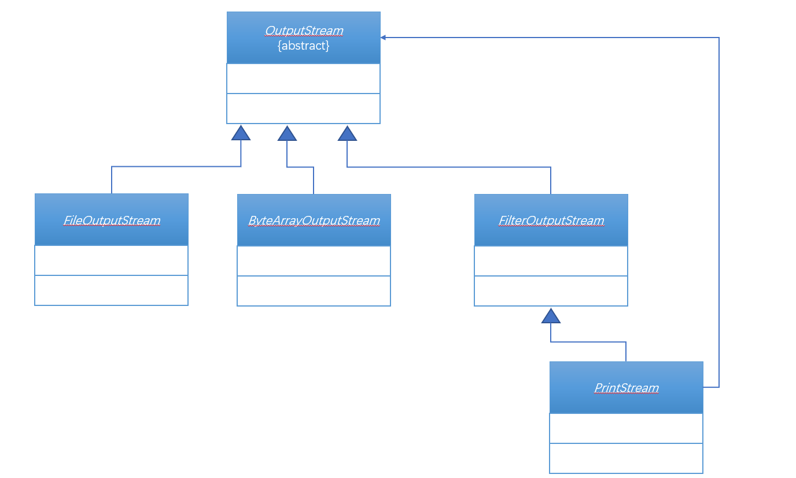

# 第四十九章：打印流

## 1. 知识点
> 1. 分析打印流的产生与基本设计思想；
2. 观察JDK1.5后打印流的新支持；

## 2. 具体内容
### 2.1 打印流设计思想
如果要进行数据的输入使用InputStream，输出使用OutputStream。可是在现实环境中会发现一些问题：OutputStream和InputStream只能够受限于byte[](字节数组)类型,本次先来解决输出流的问题。

现在希望可以设计一个类：这个类可以实现String、int、double数据的输出。

##### 范例：设计思路
```java
class PrintUtil{
    private OutputStream output;

    public PrintUtil(OutputStream output){
        this.output = output;
    }

    public void print(String str){
        try {
            this.output.write(str.getBytes());
        } catch (IOException e) {
            e.printStackTrace();
        }
    }
    public void print(int i){
        this.print(String.valueOf(i));
    }
    public void print(double d){
        this.print(String.valueOf(d));
    }
    public void println(String str){
        this.print(str + "\n");
    }
    public void println(int i){
        this.println(String.valueOf(i));
    }
    public void println(double d){
        this.println(String.valueOf(d));
    }

    public void close(){
        try {
            this.output.close();
        } catch (IOException e) {
            e.printStackTrace();
        }
    }
}
public class TestDemo15 {
    public static void main(String[] args) throws FileNotFoundException {
        PrintUtil pu = new PrintUtil(new FileOutputStream(new File("E:" + File.separator + "message.txt")));
        pu.println("Hello World!");
        pu.print("我的名字：");
        pu.print("敖翀");
        pu.print("年龄：");
        pu.print("24");
        pu.close();
    }
}
```
虽然简单了，但是本质上没有离开OutputStream类的原始支持，只是将这个类的功能增强了。

### 2.2 使用打印流输出
在java.io包中提供有两个打印流：PrintStream（字节打印流）、PrintWriter(字符打印流)，下面来观察这两个打印流的继承结构和构造方法：

| PrintStream                                | PrintWriter                                |
| ------------------------------------------ | ------------------------------------------ |
|  |  |
| public PrintStream(OutputStream out)       | public PrintWriter(OutputStream out)       |
|                                            | public PrintWriter(Writer out)             |

以PrintStream类的继承结构分析：



这种结构非常类似于代理设计模式，但是与代理设计模式有两点差别：
* 代理设计模式必须以接口的设计为主；
* 代理设计模式执行的时候调用的依然是父接口中定义的方法；

而在PrintStream类中使用print()或者println()方法要比使用OutputStream中的write()更加方便，适合于各种数据类型的输出，所以这样的设计属于装饰设计模式。
```java
public class TestDemo15 {
    public static void main(String[] args) throws FileNotFoundException {
        PrintStream pu = new PrintStream(new FileOutputStream(new File("E:" + File.separator + "message.txt")));
        pu.println("Hello World!");
        pu.print("我的名字：");
        pu.print("敖翀");
        pu.print("年龄：");
        pu.print("24");
        pu.close();
    }
}
```
如果以后需要进行内容的输出操作，那么使用最方便的一定是打印流，在以后的开发之中，如果程序要输出文字信息，就使用打印流。

### 2.3 格式化输出（JDK1.5新支持）
PrintStream类实际上从JDK1.0就开始存在了，但是在JDK15的时候为其增加了一个新的功能：
* 格式化输出：`public PrintStream printf(Locale l,String format,Object... args)`;

如果要进行格式化，可以使用这些标记：字符串（%s）、整数（%d）、小数（%m.nf）；

##### 范例：格式化输出
```java
public class TestDemo16 {
    public static void main(String[] args) throws FileNotFoundException {
        PrintStream pu = new PrintStream(new FileOutputStream(new File("E:" + File.separator + "test.txt")));
        String name = "张三";
        int age = 10;
        double score = 59.356;
        pu.printf("姓名：%s, 年龄：%d,分数：%5.2f",name,age,score);
        pu.close();
    }
}
```
但是JDK1.5之后不光PrintStream类发生了改变，String类也发生了改变，提供了格式化字符串操作：
* 方法：`public static String format(Locale l,String format,Object... args)`；

##### 范例：格式化字符串
```java
public class TestDemo17 {
    public static void main(String[] args) {
        String name = "张三";
        int age = 20;
        double score = 59.356;
        String str = String.format("姓名：%s, 年龄：%d, 分数： %5.2f",name,age,score);
        System.out.println(str);
    }
}
```

以上的这两点特点基本上意义不大。

## 3. 知识点总结
1. 打印流使用的是装饰设计模式，加强OutputStream的功能；
2. 打印流可以替代OutputStream实现数据的输出操作；
