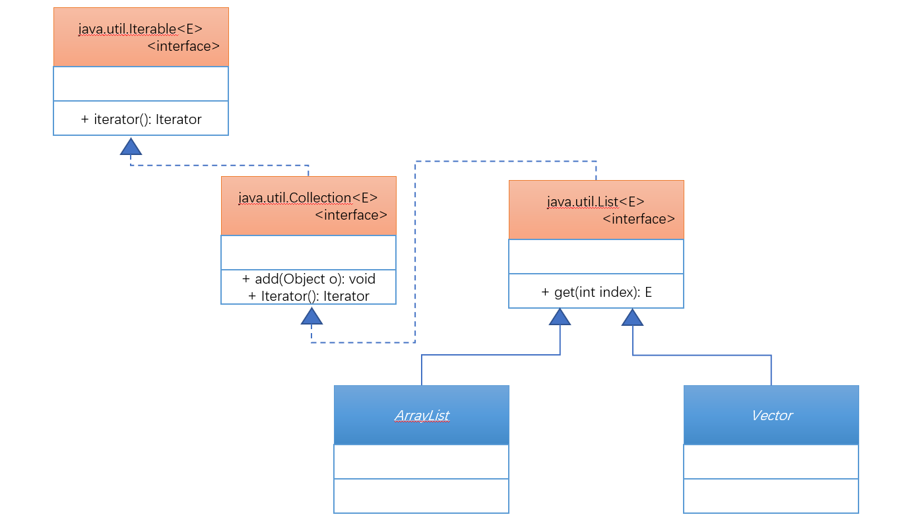
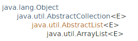
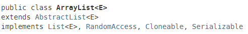
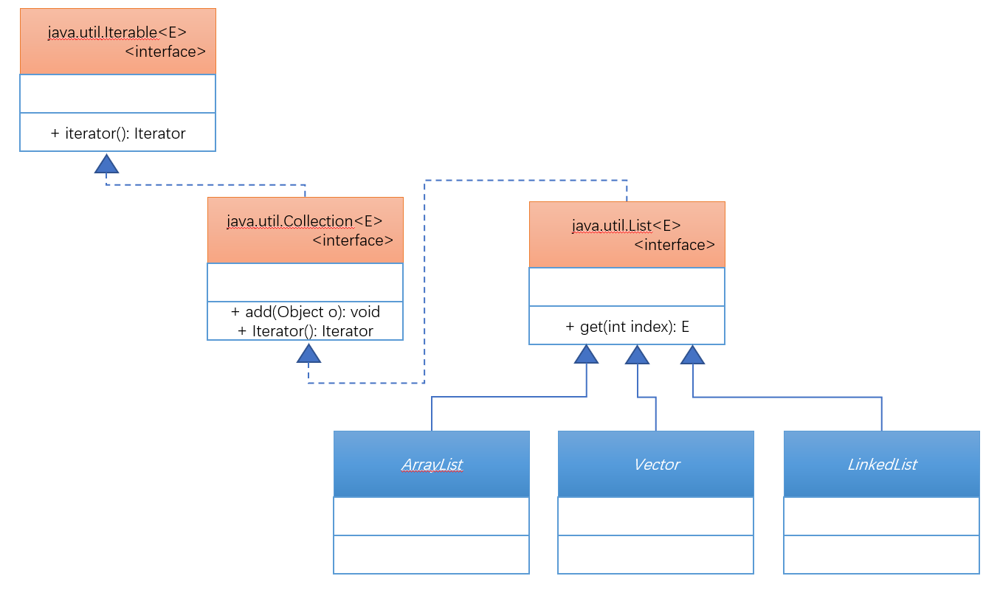

# 第五十四章：List集合接口

## 1. 知识点
> List接口的定义以及相关子类的使用；
## 2. 具体内容
### 2.1 List接口简介
List子接口保存数据的最大特点实际上在于可以进行重复数据的保存。首先需要明确的一点，List子接口针对于Collection子接口进行了大量的方法扩充：

| No  | 方法名称                              | 类型 | 描述                     |
| --- | ------------------------------------- | ---- | ------------------------ |
| 1   | public E get(int index)               | 普通 | 根据索引取得指定元素内容 |
| 2   | public E set(int index,E element)     | 普通 | 修改指定索引元素的内容   |
| 3   | public ListIterator<E> listIterator() | 普通 | 为ListIterator接口实例化 |

但是List本身属于一个接口，如果要想取得接口的实例化对象，那么应该通过子类实例化完成，那么在List子类下有两个常用的子类：ArrayList、Vector;



### 2.2 ArrayList子类
ArrayList是在JDK1.2的时候推出的，可以说只要使用了List子接口，那么基本上首选的一定是ArrayList子类，下面来观察一下ArrayList定义结构：

<table border="1">
  <tr>
    <th></th>
    <th></th>
  </tr>
</table>

#### 范例：List的基本使用
```java
public class TestDemo {
    public static void main(String[] args) {
        List<String> list = new ArrayList<String>();
        System.out.println("是否为空：" + list.isEmpty());
        System.out.println("数据个数：" + list.size());
        list.add("hello");
        list.add("hello");
        list.add("world");
        System.out.println("是否为空：" + list.isEmpty());
        System.out.println("数据个数：" + list.size());
        System.out.println(list);
    }
}
```
既然要进行集合的数据输出，很明显不可能直接输出接口对象，那么可以采用循环的方式完成。
* 利用size()方法控制循环次数，而后利用get()方法取出集合数据；

```java
for(int x = 0;x<list.size();x++){
    System.out.println(list.get(x));
}
```
如果以上的操作不使用List接口接收，而使用了Collection接口接收，那么就在于get()的问题上了。因为get()方法是由List子接口定义的。

```java
public class TestDemo1 {
    public static void main(String[] args) {
        Collection<String> list = new ArrayList<String>();
        list.add("hello");
        list.add("hello");
        list.add("world");
        Object obj[] = list.toArray();
        for(int x=0;x<obj.length;x++){
            System.out.println(obj[x]);
        }
    }
}
```
但是在List的接口中提供有contains()、remove()的操作方法，那么这两个操作方法都需要equals()方法的支持。

```java
class Dept{
    private int deptno;
    private String name;
    private String loc;

    public Dept(int deptno, String name, String loc) {
        this.deptno = deptno;
        this.name = name;
        this.loc = loc;
    }

    @Override
    public String toString() {
        return "Dept{" +
                "deptno=" + deptno +
                ", name='" + name + '\'' +
                ", loc='" + loc + '\'' +
                '}';
    }

    @Override
    public boolean equals(Object o) {
        if (this == o) {return true;}
        if (o == null || getClass() != o.getClass()) {return false;}
        Dept dept = (Dept) o;
        return deptno == dept.deptno &&
                Objects.equals(name, dept.name) &&
                Objects.equals(loc, dept.loc);
    }

    @Override
    public int hashCode() {
        return Objects.hash(deptno, name, loc);
    }
}
public class TestDemo2 {
    public static void main(String[] args) {
        List<Dept> all = new ArrayList<Dept>();
        all.add(new Dept(10,"业务部","北京"));
        all.add(new Dept(20,"技术部","杭州"));
        all.add(new Dept(30,"市场部","上海"));
        all.remove(new Dept(30,"市场部","上海"));
        for(int x=0;x<all.size();x++){
            Dept dept = all.get(x);
            System.out.println(dept);
        }
    }
}
```
整个过程的使用和自定义的链表是完全一样的，原理的操作形式也是完全一样的。

### 2.3 Vector子类
打开Java Doc文档可以发现Vector与ArrayList类的继承结构是完全相同的。

```java
public class Vector<E>
extends AbstractList<E>
implements List<E>, RandomAccess, Cloneable, Serializable
```

Vector类中的方法基本上都是同步方法，属于线程安全的操作。

#### 范例：利用Vecotor为List的子接口实例化
```java
public class TestDemo {
    public static void main(String[] args) {
        List<String> list = new Vector<String>();
        System.out.println("是否为空：" + list.isEmpty());
        System.out.println("数据个数：" + list.size());
        list.add("hello");
        list.add("hello");
        list.add("world");
        for(int x = 0;x<list.size();x++){
            System.out.println(list.get(x));
        }
        System.out.println("是否为空：" + list.isEmpty());
        System.out.println("数据个数：" + list.size());
        System.out.println(list);
    }
}
```

操作上几乎是感觉不出区别的，具体的区别只能够根据源代码来观察。

##### 面试题：请解释ArrayList与Vector的区别？
| No  | 区别点   | ArrayList                       | Vector                                       |
| --- | -------- | ------------------------------- | -------------------------------------------- |
| 1   | 推出时间 | JDK1.2                          | JDK1.0                                       |
| 2   | 性能     | 异步处理，性能更高              | 同步处理，性能较低                           |
| 3   | 安全性   | 非线程安全的操作                | 线程安全的操作                               |
| 4   | 输出     | Iterator、ListIterator、foreach | Iterator、ListIterator、foreach、Enumeration |

从以后的开发角度来看，ArrayList是最常用的一种形式。

### 2.4 LinkedList子类



因为Vector是List的子类，所以可以直接实例化List
```java
public class TestDemo {
    public static void main(String[] args) {
        List<String> list = new Vector<String>();
        System.out.println("是否为空：" + list.isEmpty());
        System.out.println("数据个数：" + list.size());
        list.add("hello");
        list.add("hello");
        list.add("world");
        for(int x = 0;x<list.size();x++){
            System.out.println(list.get(x));
        }
        System.out.println("是否为空：" + list.isEmpty());
        System.out.println("数据个数：" + list.size());
        System.out.println(list);
    }
}
```
如果你要真想观察LinkedList与ArrayList类的区别，要观察子类。
* 追加首元素：`public void addFirst(E e)`；
* 追加尾元素：`public void addLast(E e)`；
* 追加：`public void push(E e)`；
* 弹出：`public E pop()`；

```java
public class TestDemo3 {
    public static void main(String[] args) {
        LinkedList<String> list = new LinkedList<>();
        list.add("hello");
        list.add("hello");
        list.addLast("傻子");
        list.add("world");
        list.addFirst("呆子");
        list.push("fskjhj");
        System.out.println(list);
        System.out.println(list.pop());
        System.out.println(list.pop());
    }
}
```
LinkedList是一个真正的链表的实现类，其功能要比ArrayList（List子接口）更加的丰富，但是大部分情况下使用不到这个类，用到的最多的一定是ArrayList。

## 3. 知识点总结
> 1. List子接口比Collection定义了更多的方法，List子接口中主要使用ArrayList子类；
2. List有一个方法: `public E get(int index)`；
