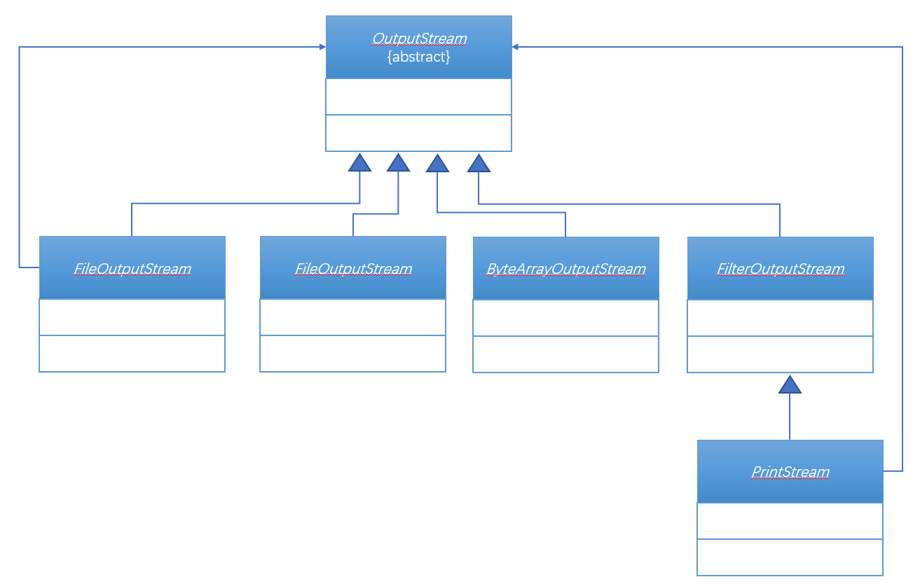
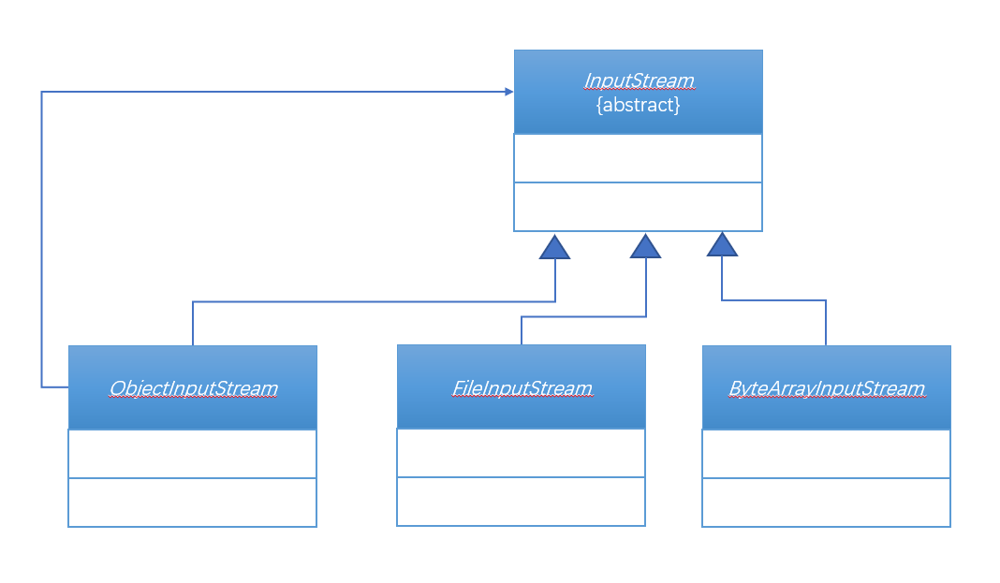

# 第五十二章：对象序列化

## 1. 知识点
> 1. 对象序列化的意义；
2. 对象序列化的实现；
3. transient关键字的使用；

## 2. 具体内容
### 2.1 对象序列化基本概念
对象序列化指的是将在内存中保存的对象变为二进制数据流，这样就意味着对象可以保存在文件中或者进行各种传输操作。但是并不是所有的类对象都可以被序列化，如果某一个类的对象需要被序列化，则这个类必须实现java.io.Serializable接口。但是这个接口并没有任何的方法定义，因为其描述的是一种能力，属于标识接口。

##### 范例：定义可以被序列化的类
```java
class Person implements Serializable{
    private String name;
    private int age;

    public Person(String name, int age){
        this.name = name;
        this.age = age;
    }

    @Override
    public String toString() {
        return "Person{" +
                "name='" + name + '\'' +
                ", age=" + age +
                '}';
    }
}
```
以后Person类的对象就而言被传输或被保存在文件之中了。

### 2.2 利用ObjectOutputStream类实现序列化操作
如果要进行对象的序列化操作，那么必须要依靠java.io.ObjectOutputStream类。


构造方法：`public ObjectOutputStream(OutputStream out) throws IOException`

当取得了ObjectOutputStream类的实例化对象之后就可以实现序列化操作了：
* 输出对象：`public final void writeObject(Object obj) throws IOException`；

##### 范例：序列化对象
```java
class Person implements Serializable{
    private String name;
    private int age;

    public Person(String name, int age){
        this.name = name;
        this.age = age;
    }

    @Override
    public String toString() {
        return "Person{" +
                "name='" + name + '\'' +
                ", age=" + age +
                '}';
    }
}
public class TestDemo {
    public static void main(String[] args) throws Exception {
        ser(new Person("张三",20));
    }

    public static void ser(Person per) throws Exception{
        ObjectOutputStream oos = new ObjectOutputStream(new FileOutputStream(new File("E:" + File.separator + "person.txt")));
        oos.writeObject(per);
        oos.close();
    }
}
```
这种序列化的代码是固定的，所以这样的开发操作以后都不会需要开发者自己处理。

### 2.3 利用ObjectInputStream类实现反序列化操作
利用ObjectOutputStream输出的文件信息都是二进制的数据，但是这数据大部分人事看不懂的，所以如果要想将数据还原，那么就必须利用ObjectInputStream类进行反序列化操作。
* 构造方法：`public class ObjectInputStream extends InputStream implements ObjectInput, ObjectStreamConstants`；



当取得了ObjectInputStream类之后可以利用如下方法实现对象的反序列化：
* 反序列化：`public final Object readObject() throws IOException,ClassNotFoundException`;

##### 范例：反序列化操作
```java
public static void dser() throws Exception{
        ObjectInputStream ois = new ObjectInputStream(new FileInputStream(new File("E:" + File.separator + "person.txt")));
        Object obj = ois.readObject();
        System.out.println(obj);
        ois.close();
    }
```
ObjectOutputStream输出的信息只能够通过ObjectInputStream读取。

### 2.4 transient关键字
默认情况下，一个对象中的所有属性都一定要被序列化下来，那么现在如果某些属性不希望被序列化，则可以使用transient关键字定义。

##### 范例：transient关键的使用
```java
private transient int age;
```
在序列化过程之中age这个字段将不被保存，由于transient关键字的作用，所以当数据被反序列化完成后，此数据为其对应数据类型的默认值。

## 3. 知识点总结
> 1. 用户所关心的只有一个java.io.Serializable接口，几乎简单Java类都要实现此接口；
2. ObjectOutputStream、ObjectInputStream很少会由用户自己操作；
3. transient虽然可以保证属性不被序列化，但是很少出现；
4. 文件拷贝：File、OutputStream、InputStream，以后学习MVC框架中会使用到；
5. 文件的输出使用打印流、文件的输入使用扫描流（BufferedReader备用）
6. 对象序列化实现Serializable接口。
