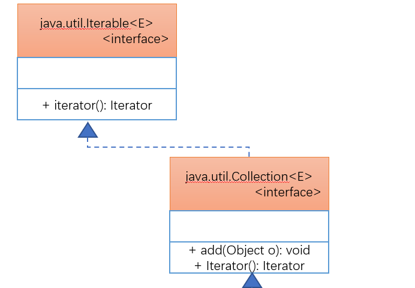

# 第五十三章：类集框架简介

## 1. 知识点
> 类集产生的目的

## 2. 具体内容
> 在所有的项目开发过程之中，都不可避免的要面对一个问题：**数组长度有限** 。而且在数组中进行数组的维护也是非常困难的，例如：删除后再添加。正因为数组的操作不方便，所以在开发中数组出现的情况很少。

### 2.1 类集框架简介
如果要想摆脱数组操作的一切困扰，首先可以想到的是数据结构，可以在之前使用了自定义链表来完成，但是这个自定义链表实现起来，有如下困难：
* 链表的实现对于初学者使用难度高；
* 如果要想实现一个高性能的链表比较麻烦；
* 链表之中虽然可以使用Object进行接收，但是依然会存在有强制转型问题；

> 于是在最早的Java时代，为了解决这个问题，提供了一系列的处理类：Vector、Hashtable、Enumeration。随后在JDK1.2之后开始Java正式引入了类集框架的概念，Java中就可以方便的实现动态数组的操作，同时在JDK1.5之后由于泛型技术的使用，类集又避免了Object类对程序的影响。

所有的类集开发类都保存在java.util包中。从JDK1.8开始，类集又发生了变化，支持了数据流的操作，支持MapReduce的操作。

对于这些数据结构而言，Node类的存在是至关重要的。

### 2.2 类集框架核心接口
在java.util包中定义的类集框架其核心的组成接口有如下几种：
* Collection接口(80%)：它是负责保存单值的最大父接口；
  * List子接口(90%)：允许保存重复元素，数据的保存顺序就是数据的增加顺序；
  * Set子接口(10%)：不允许保存重复元素，并且内部的元素可以进行调整；
* Map接口(20%)：提供的就是key与value的匹配信息；
* 输出接口：Iterator、ListIterator、Enumeration；

**结论：** 所有的集合保存数据的目的都是为了输出；
* Collection保存数据的目的纯粹只是为了输出，所以最关注的就是增加数据和输出数据的操作；
* Map保存数据的目的是为了根据key查找value，是为了查找准备的。

Collection是在集合开发之中使用较多的接口，那么在这个接口定义有大量的操作方法

对于Collection设计的方法：

| No  | 方法名称                          | 类型 | 描述                                       |
| --- | --------------------------------- | ---- | ------------------------------------------ |
| 1   | public boolean add(E e)           | 普通 | 向集合中追加数据                           |
| 2   | public void clear()               | 普通 | 清空集合                                   |
| 3   | public boolean contains(Object o) | 普通 | 判断集合内容是否存在，需要equals()方法支持 |
| 4   | public boolean isEmpty()          | 普通 | 是否为空集合                               |
| 5   | public int size()                 | 普通 | 取得集合中的元素个数                       |
| 6   | public boolean remove(Object o)   | 普通 | 删除数据，依靠equals()方法支持             |
| 7   | public Iterator<E> iterator()     | 普通 | 取得Iterator接口对象                       |
| 8   | public Object[] toArray()         | 普通 | 将集合变为对象数组返回                     |

大部分情况下都要求以add()、iterator()两个方法是使用为主。

## 3. 知识点总结
> 1. 类集的本质就是动态对象数组。
2. 之前的链表就是按照集合的标准实现的；
