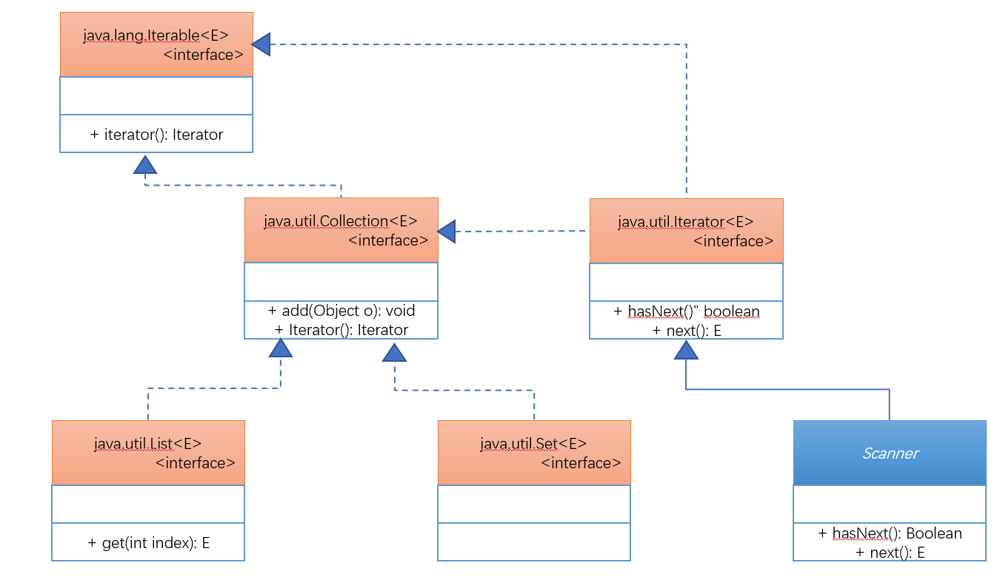
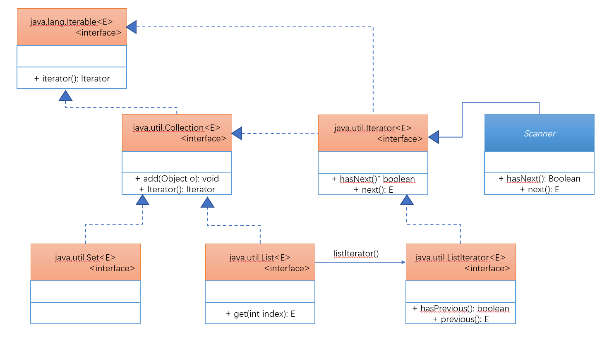
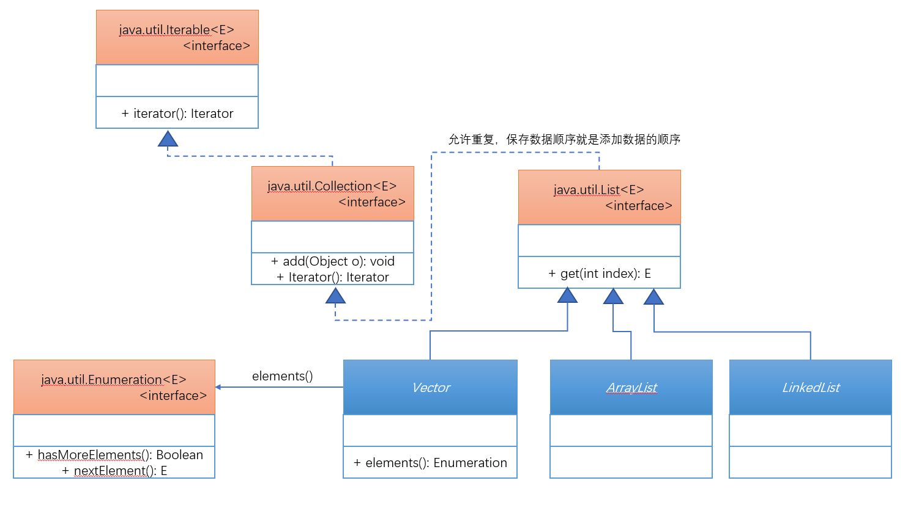
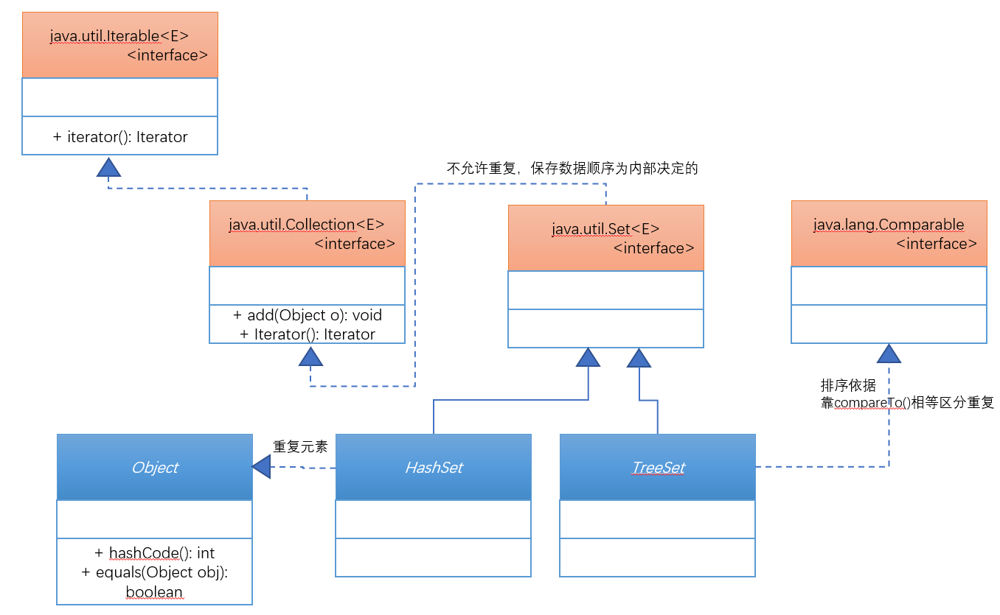
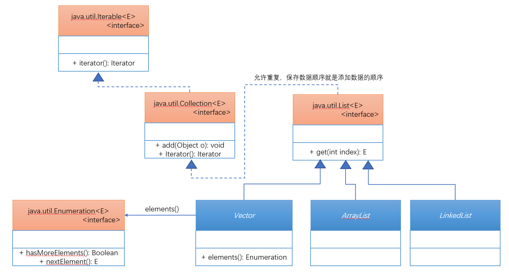

# 第五十六章：类集输出

## 1. 知识点
> 集合的四种输出方式：Iterator、ListIterator、Enumeration、foreach。

## 2. 具体内容
### 2.1 Iterator迭代输出
Iterator是集合输出中最为标准的操作接口，同时以后只要是结合的输出想都不要想，就是用Iterator输出完成。

如果要想取得Iterator接口的实例化对象，在Collection接口中已经明确定义了：`public Iterator<E> iterator()`；



随后来观察一下Iterator接口的定义结构：
```java
public interface Iterator<E>{
	public interface Iterator<E>;
	public E next();
}
```

#### 范例：利用Iterator实现迭代输出
```java
public class TestDemo4 {
    public static void main(String[] args) {
        List<String> all = new ArrayList<>();
        all.add("hello");
        all.add("world");
        all.add("你好");
        all.add("世界");
        Iterator<String> iter = all.iterator();
        while(iter.hasNext()){
            String str = iter.next();
            System.out.println(str);
        }
    }
}
```
但是在这里面有一点说明，在Collection接口中存在有一个remove()方法，而且在JDK1.8中发现Iterator接口也提供有一个remove()方法(default void remove())。
```java
public class TestDemo4 {
    public static void main(String[] args) {
        List<String> all = new ArrayList<>();
        all.add("hello");
        all.add("world");
        all.add("你好");
        all.add("世界");
        Iterator<String> iter = all.iterator();
        while(iter.hasNext()){
            String str = iter.next();
            if("world".equals(str)){
//                all.remove(str);
                iter.remove();
            }else {
                System.out.println(str);
            }

        }
    }
}
```
在迭代输出时如果要删除集合中的数据，不可能使用集合中的remove()方法，而只能使用Iterator中的remove()方法。

### 2.2 ListIterator双向迭代输出
在大部分情况下，如果要进行输出操作，一定使用的是Iterator，并且基本上只输出一次，但是如果说要想实现双向的迭代输出，那么就只能够利用ListIterator子接口完成。



#### 范例：双向迭代
```java
public class TestDemo5 {
    public static void main(String[] args) {
        List<String> all = new ArrayList<>();
        all.add("hello");
        all.add("world");
        all.add("你好");
        all.add("世界");
        ListIterator<String> iter = all.listIterator();
        System.out.print("由前向后迭代：");
        while(iter.hasNext()){
            System.out.print(iter.next() + "、");
        }
        System.out.println();
        System.out.print("由后向前迭代：");
        while(iter.hasPrevious()){
            System.out.print(iter.previous() + "、");
        }
    }
}
```
在进行双向迭代操作过程之中，必须首先进行由前向后的迭代，之后才可以进行由后向前的操作。

### 2.3 Enumeration枚举输出
Enumeration接口是在JDK1.0的时候提供的，其主要是进行集合输出使用的，Enumeration接口的定义结构如下：
```java
public interface Enumeration<E>{
	public boolean hasMoreElements();
	public E nextElement();
}
```
Enumeration最早出现的是为Vector服务的，所以在Collection接口、List接口里面都没有提供为Enumeration接口实例化的方法，而Vector类提供了：`public Enumeration<E> elements()`。



```java
public class TestDemo {
    public static void main(String[] args) {
        Vector<String> all = new Vector<>();
        all.add("hello");
        all.add("world");
        all.add("你好");
        all.add("世界");
        Enumeration enu = all.elements();
        while(enu.hasMoreElements()){
            System.out.println(enu.nextElement());
        }
    }
}
```
Enumeration在日后的开发中有着及其重要的作用，以后也一定会使用到。

### 2.4 foreach输出
JDK1.5之后提供的foreach输出的形式除了可以支持数组输出之外也可以支持集合输出，其本身的使用形式还是很简单的。

#### 范例：实现foreach输出
```java
public class TestDemo6 {
    public static void main(String[] args) {
        List<String> all = new ArrayList<>();
        all.add("hello");
        all.add("world");
        all.add("你好");
        all.add("世界");
        for (String s:all
             ) {
            System.out.println(s);
        }
    }
}
```
不建议过多的使用这样的形式进行操作。

## 3. 知识点总结
> 1. 集合输出首先想到的就是Ierator接口；
2. 如果实在必须的情况下使用Enumeration接口；




