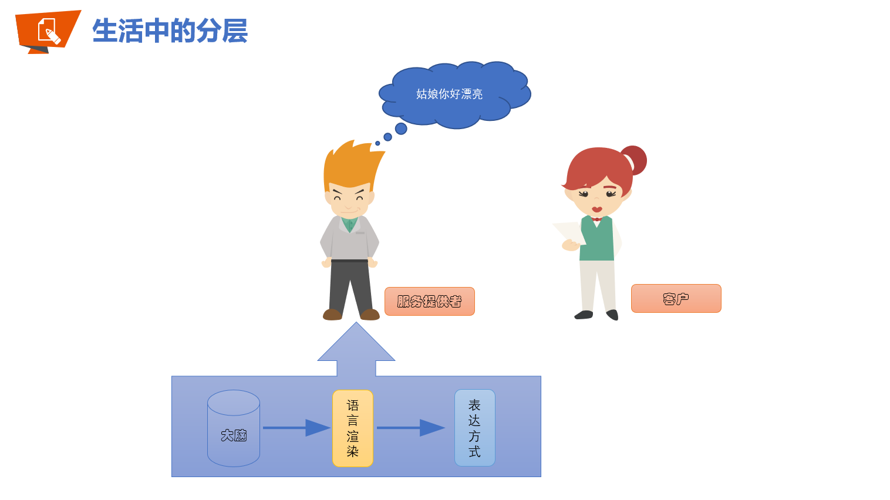
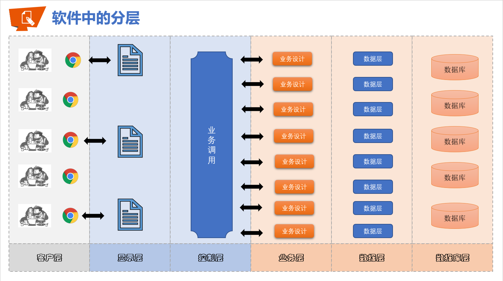

# 第六十六章：软件设计规划

## 1. 知识点

## 2. 具体内容
所有的项目开发过程之中业务是整个项目的核心，围绕着业务的展开才能够进行项目的设计，而只有业务确定之后才可能去确定所谓的高并发、高可用、分布式（高性能）的解决方案。

### 2.1 软件分层设计
对于现在为止的软件项目一定要考虑分层的设计原则，每一层都一定要有自己的用途。例如：生活中的说话



继续以上面的结构为例，实际上会发现软件的分层会分为如下几种情况：



所谓的全栈工程师：
* 前可做美工；
* 后可做业务分析设计以及代码实现；
* 左可做DBA兼职网管；
* 右可做运维与集群部署；

真正的项目有用的部分实际上就是业务设计，RPC技术、SpringCloud技术，都是作为业务抽象使用的。

### 2.2 设计分析实例
清楚了软件的分层设计之后实际上就可以进一步的去理解什么叫业务分析与设计了。

假如说现在有一张用户表：
```sql
DROP TABLE member PURGE;

CREATE TABLE member(
  mid   VARCHAR2(50),
  name  VARCHAR2(50),
  age   NUMBER(3),
  birthday  DATE,
  sex   VARCHAR2(10),
  note  CLOB,
  CONSTRAINT pk_mid PRIMARY KEY(mid)
);
```
现在针对于以上数据表完成如下的功能设计：
* 【业务层】可以实现新用户的追加；
  * 【数据层】判断当前追加的用户ID是否存在；
  *  还需要判断用户的年龄、性别等问题，至少你的年龄应该是整数，年龄应该和生日匹配；
  *  【数据层】执行数据的增加处理；
* 【业务层】可以根据用户编号进行用户信息的查询；
  * 【数据层】这对于数据库执行一个SELECT查询即可；
* 【业务层】可以修改一个用户的信息；
  * 判断用户的年龄、性别等问题；
  * 【数据层】执行更新处理；
* 【业务层】可以删除一个用户的信息；
  * 【数据层】直接执行DELETE，如果该数据不存在删除影响的行数是0；
* 【业务层】可以查询出全部的用户的数据信息；
  * 【数据层】执行查询全部；
* 【业务层】允许进行模糊查询处理，查询的同时可以返回模糊查询的数据量，如果没有设置查询关键字，则可以进行查询全部数据的操作处理，也需要同时返回查询的数据量；
  * 【数据层】模糊查询操作；
  * 【数据层】统计查询操作；


## 3. 知识点总结
